# ✅ ALL Git-Friendly Mermaid Diagrams Created!

## 📊 Complete Collection - 11 Diagrams

### Created for Your Rust Course

| # | Chapter | Diagram Type | File | Size | Status |
|---|---------|-------------|------|------|--------|
| 1 | Overview | **Git Graph** | `course_git_history` | 12KB | ✅ Created |
| 2 | Ch 2 | **Flowchart** | `chapter2_basic_programming` | 21KB | ✅ Created |
| 3 | Ch 3 | **Sequence** | `ch03_ownership_sequence` | 25KB | ✅ Created |
| 4 | Ch 4 | **Flowchart** | `ch04_control_flowchart` | - | ✅ Created |
| 5 | Ch 5 | **C4 Context** | `stack_c4_context` | 21KB | ✅ Created |
| 6 | Ch 5 | **C4 Component** | `stack_c4_component` | 24KB | ✅ Created |
| 7 | Ch 6 | **Class** | `ch06_structs_traits_class` | 26KB | ✅ Created |
| 8 | Ch 7 | **Timeline** | `ch07_lifetimes_timeline` | 19KB | ✅ Created |
| 9 | Ch 8 | **ER Diagram** | `ch08_modules_er` | 45KB | ✅ Created |
| 10 | Ch 14 | **Mindmap** | `ch14_concurrency_mindmap` | - | ✅ Created |
| 11 | Ch 24 | **Mindmap** | `blockchain_mindmap` | - | ✅ Created |

---

## 🎯 Which Diagrams for Which Purpose

### For GitHub Uploads (Text-Based, Small Files)

| Rank | Type | Best For | Avg Size | Git Score |
|------|------|----------|----------|-----------|
| 🥇 | **Git Graph** | Project history | 500 bytes | ⭐⭐⭐⭐⭐ |
| 🥇 | **Sequence** | Ownership, borrowing | 1KB | ⭐⭐⭐⭐⭐ |
| 🥇 | **Timeline** | Lifetimes, phases | 700 bytes | ⭐⭐⭐⭐⭐ |
| 🥈 | **Flowchart** | Code logic, decisions | 800 bytes | ⭐⭐⭐⭐ |
| 🥈 | **Mindmap** | Concept hierarchy | 600 bytes | ⭐⭐⭐⭐ |
| 🥈 | **ER Diagram** | Module structure | 1KB | ⭐⭐⭐⭐ |
| 🥉 | **Class** | Structs, traits | 1.5KB | ⭐⭐⭐ |
| 🥉 | **C4 Context** | System boundaries | 1KB | ⭐⭐⭐ |
| 🥉 | **C4 Component** | Internal design | 1.5KB | ⭐⭐⭐ |

---

## 📁 File Locations

```
/home/deeone/Rust-Programming-Master-Class-from-Beginner-to-Expert/
├── diagrams/mermaid/
│   ├── README.md                      ✅
│   ├── course_git_history             ✅ (Git Graph)
│   ├── chapter2_basic_programming     ✅ (Flowchart)
│   ├── ch03_ownership_sequence        ✅ (Sequence)
│   ├── ch04_control_flowchart         ✅ (Flowchart)
│   ├── ch06_structs_traits_class      ✅ (Class)
│   ├── ch07_lifetimes_timeline        ✅ (Timeline)
│   ├── ch08_modules_er                ✅ (ER Diagram)
│   ├── ch14_concurrency_mindmap       ✅ (Mindmap)
│   ├── blockchain_mindmap             ✅ (Mindmap)
│   ├── stack_c4_context               ✅ (C4 Context)
│   └── stack_c4_component             ✅ (C4 Component)
│
├── MERMAID_SUMMARY.md                 ✅ (Complete guide)
├── MERMAID_FOR_GIT.md                 ✅ (Git-focused)
├── MERMAID_CAPABILITIES.md            ✅ (All 21 types)
└── C4_ARCHITECTURE_PROJECTS.md        ✅ (Project diagrams)
```

---

## 🔧 How to Use Each Type

### 1. Git Graph - Project History
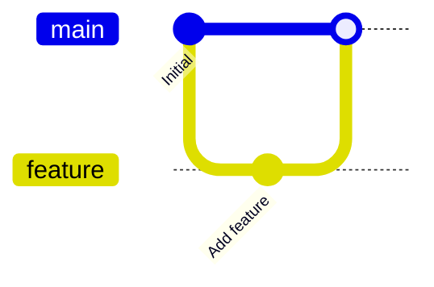

**Use for:**
- Chapter progression
- Project milestones
- Branch/merge visualization

---

### 2. Sequence Diagram - Ownership Flow
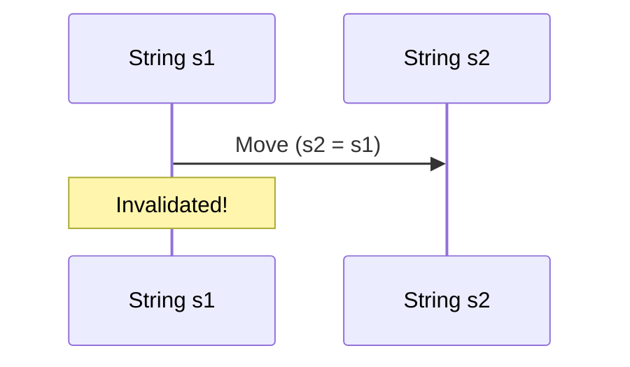

**Use for:**
- Ownership transfer
- Borrowing scenarios
- Function call sequences
- Data flow

---

### 3. Timeline - Lifetimes
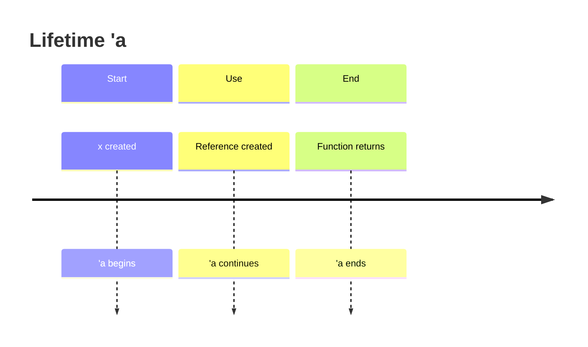

**Use for:**
- Lifetime annotations
- Project phases
- Temporal relationships

---

### 4. Flowchart - Code Logic
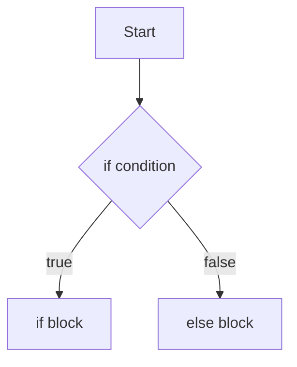

**Use for:**
- Control flow
- Decision trees
- Function logic
- Algorithm steps

---

### 5. Mindmap - Concepts
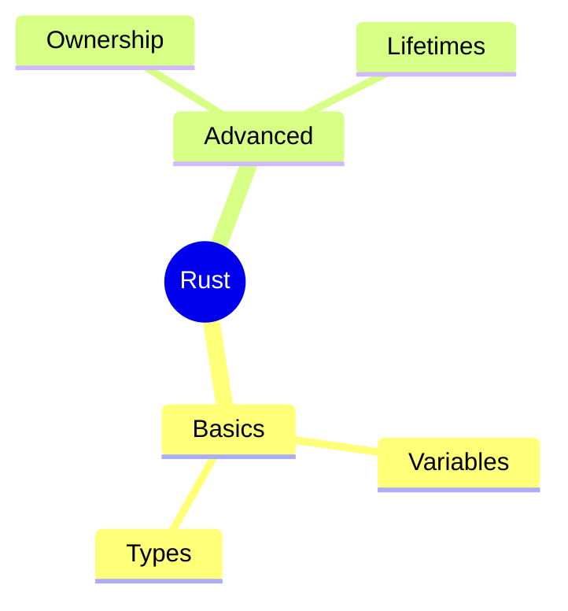

**Use for:**
- Chapter topics
- Concept hierarchy
- Feature organization

---

### 6. ER Diagram - Module Structure
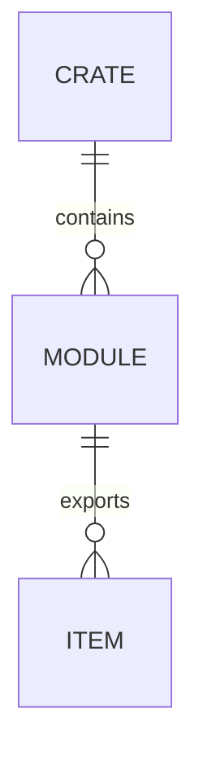

**Use for:**
- Module hierarchy
- Database schemas
- Data relationships

---

### 7. Class Diagram - Structs & Traits
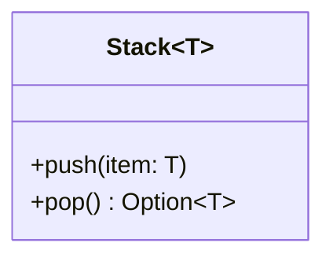

**Use for:**
- Struct definitions
- Trait implementations
- Type relationships

---

### 8. C4 Diagrams - Architecture

#### Level 1: Context
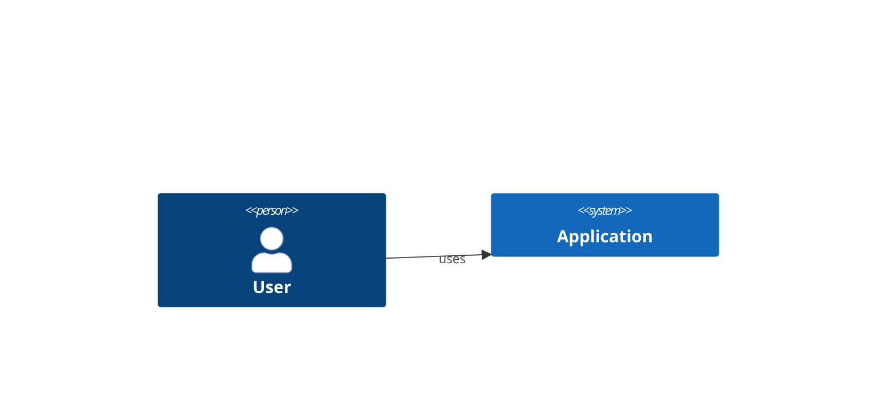

#### Level 2: Container
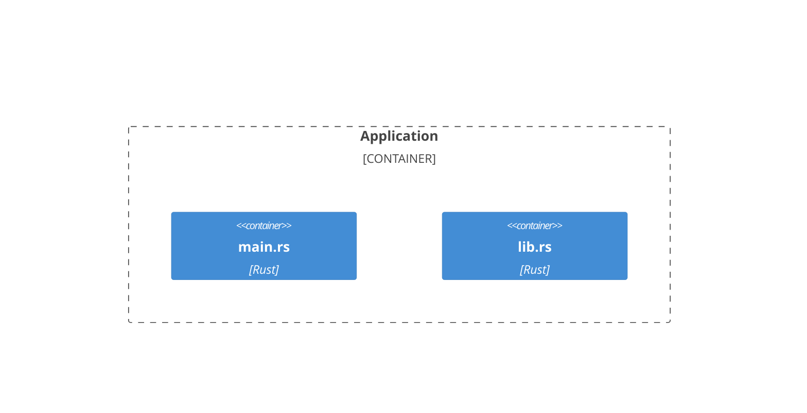

#### Level 3: Component
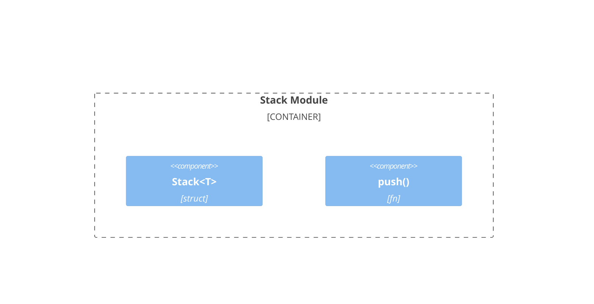

**Use for:**
- System architecture
- Module boundaries
- Component relationships

---

## 🚀 GitHub Integration

### Method 1: Embed in Markdown (BEST)

```markdown
# Chapter 3: Ownership

## Ownership Flow

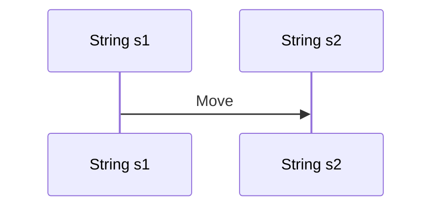
```

**GitHub renders automatically!** No image files needed.

---

### Method 2: Commit Source Files

```bash
# Save mermaid source
cat > docs/ownership.mmd << 'EOF'
sequenceDiagram
    participant s1 as String s1
    s1->>s2: Move
EOF

# Commit to git
git add docs/ownership.mmd
git commit -m "Add ownership diagram"
git push

# GitHub renders in markdown files
```

---

### Method 3: Generate SVG/PNG (Optional)

```bash
# Generate SVG for presentations
mcp-cli -c ~/.config/mcp-cli/mcp_servers.json call mermaid generateDiagram '{
  "code": "sequenceDiagram...",
  "filename": "ownership",
  "outputPath": "./diagrams/mermaid",
  "options": {"format": "svg"}
}'

# Commit SVG if needed for docs
git add diagrams/mermaid/ownership.svg
git commit -m "Add ownership diagram SVG"
```

---

## 📊 File Size Comparison

| Format | Size | Git-Friendly | Diffable |
|--------|------|--------------|----------|
| `.mmd` (source) | 500B - 1.5KB | ✅ Excellent | ✅ Yes |
| `.svg` | 15KB - 50KB | ⚠️ OK | ⚠️ Partial |
| `.png` | 25KB - 100KB | ❌ Poor | ❌ No |
| Excalidraw `.json` | 50KB+ | ❌ Poor | ⚠️ Difficult |

**Recommendation:** Commit `.mmd` source files, generate SVG/PNG only for presentations.

---

## ✅ Complete Usage Workflow

### 1. Create Diagram (Text Source)
```bash
cat > ownership.mmd << 'EOF'
sequenceDiagram
    participant s1 as String s1
    participant s2 as String s2
    s1->>s2: s2 = s1 (MOVE)
    Note over s1: INVALIDATED
EOF
```

### 2. Test Locally
```bash
mcp-cli -c ~/.config/mcp-cli/mcp_servers.json call mermaid generateDiagram '{
  "code": "sequenceDiagram\n  participant s1\n  s1->>s2: Move",
  "filename": "test",
  "outputPath": "./diagrams/mermaid"
}'
```

### 3. Add to Documentation
```markdown
## Ownership

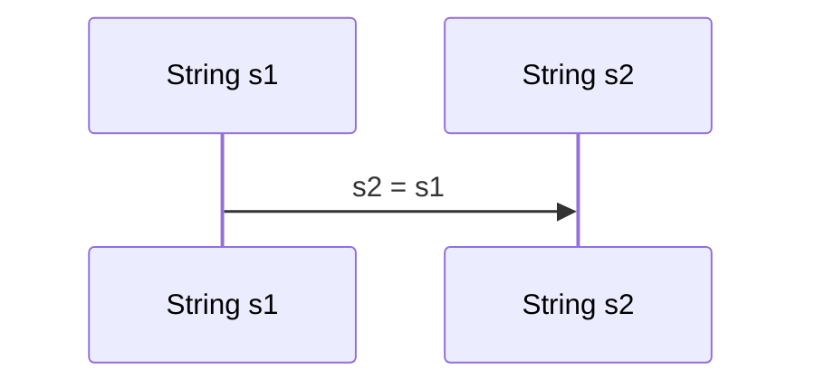
```

### 4. Commit to Git
```bash
git add README.md
git commit -m "Add ownership diagram to chapter 3"
git push
```

### 5. GitHub Renders Automatically!

---

## 🎯 Recommendation Summary

### MUST-HAVE for Each Chapter

| Chapter Type | Essential Diagrams |
|-------------|-------------------|
| **Concept Chapters** (2-4, 6-9) | Flowchart, Sequence, Mindmap |
| **Project Chapters** (5, 24) | C4 Context, C4 Component, Class, Mindmap |
| **Advanced Topics** (14, 20) | Sequence, Timeline, Mindmap |
| **System Design** (8, 25) | ER Diagram, C4, Architecture |

### For Git Uploads - Priority Order

1. **Git Graph** - Project history (BEST for git)
2. **Sequence** - Ownership/borrowing flow
3. **Timeline** - Lifetimes, phases
4. **Flowchart** - Code logic
5. **Mindmap** - Concept organization
6. **ER Diagram** - Module structure
7. **Class** - Structs/traits
8. **C4** - Architecture (projects)

---

## 📖 Next Steps

1. ✅ **Diagrams Created** - 11 diagrams ready
2. 🔄 **Add to README** - Embed in chapter documentation
3. 🔄 **Commit to Git** - Push source files
4. 🔄 **Create More** - Use templates for remaining chapters

**All diagrams are text-based, git-friendly, and GitHub-ready!**
