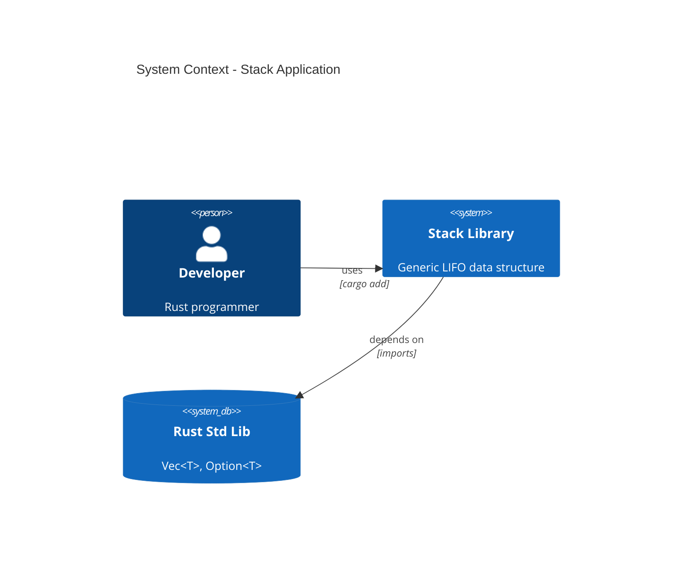
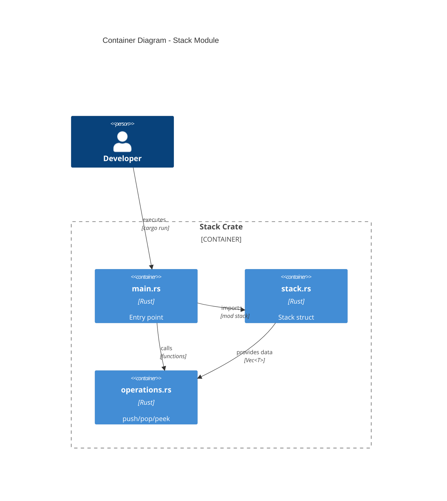
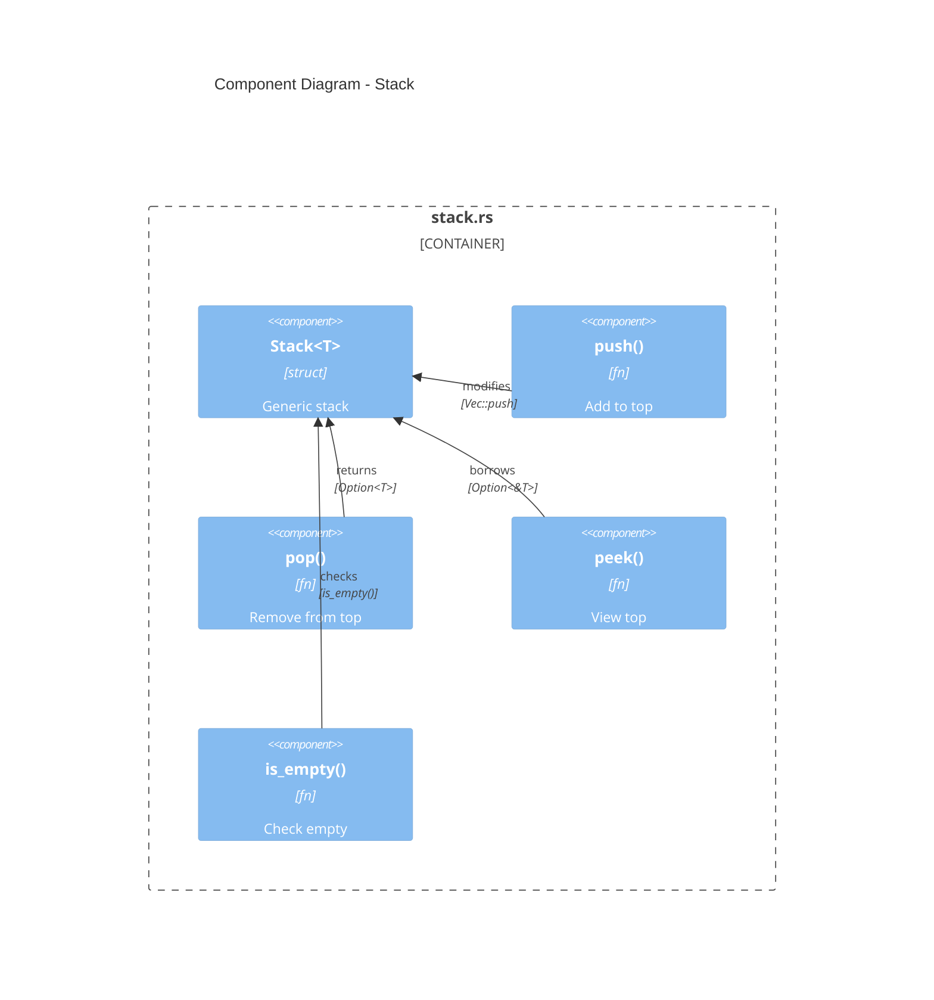
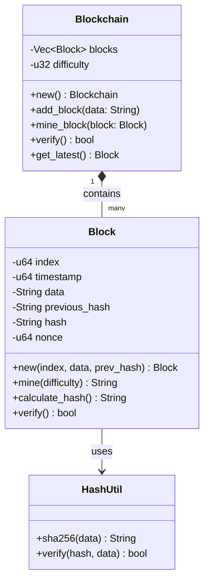

# C4 & Architecture Diagrams for Project Chapters

## ✅ Created Diagrams

### Stack Project (Chapter 5)

1. **C4 Context** - `stack_c4_context.svg`
   - Shows user, application, and Rust std lib relationships
   
2. **C4 Component** - `stack_c4_component.svg`
   - Stack<T> struct with push(), pop(), peek() functions

### Blockchain Project (Chapter 24)

1. **Blockchain Mindmap** - `blockchain_mindmap.svg`
   - Complete architecture overview

---

## 🎯 Why C4 & Architecture Are PERFECT for Projects

### C4 Model Levels

```
Level 1: Context     → Who uses it? (User → App → Libraries)
Level 2: Container   → What are the parts? (main.rs, stack.rs, functions.rs)
Level 3: Component   → How do they work? (structs, functions, methods)
Level 4: Code        → Implementation details (generated from code)
```

---

## 📊 Stack Project - Complete C4 Set

### Level 1: Context Diagram


**Shows:**
- Who uses your library
- External dependencies
- System boundaries

---

### Level 2: Container Diagram


**Shows:**
- Module structure
- File organization
- Data flow between modules

---

### Level 3: Component Diagram


**Shows:**
- Internal components
- Method relationships
- Generic type usage

---

## 🔗 Blockchain Project - Architecture Diagrams

### Architecture Beta


**Shows:**
- System architecture
- Cryptography integration
- Network topology

---

### Block Structure - Detailed View


**Shows:**
- Class structure
- Methods and fields
- Relationships

---

##  Why These Are ESSENTIAL for Projects

### 1. **System Understanding**
- New contributors understand architecture quickly
- Shows how pieces fit together
- Documents design decisions

### 2. **Git-Friendly**
```bash
# Text-based mermaid source (1-2KB)
git add docs/architecture.mmd
git commit -m "Add C4 component diagram"
# Clear diff shows what changed
```

### 3. **Living Documentation**
- Update diagram as code evolves
- Always in sync with implementation
- GitHub renders automatically

### 4. **Onboarding Tool**
- Visual guide for new team members
- Shows architecture before diving into code
- Reduces learning curve

---

## 📋 Complete Diagram Set for Projects

### For Stack Project (Chapter 5)

| Diagram | File | Purpose |
|---------|------|---------|
| C4 Context | `stack_c4_context.svg` | System boundaries |
| C4 Container | `stack_c4_container.svg` | Module structure |
| C4 Component | `stack_c4_component.svg` | Internal components |
| Class Diagram | `stack_class.svg` | Struct/impl details |
| Sequence | `stack_operations.svg` | push/pop flow |

### For Blockchain Project (Chapter 24)

| Diagram | File | Purpose |
|---------|------|---------|
| Architecture | `blockchain_arch.svg` | System architecture |
| Block Structure | `block_structure.svg` | Block internals |
| Class Diagram | `blockchain_class.svg` | Struct relationships |
| Mindmap | `blockchain_mindmap.svg` | Concept overview |
| Sequence | `mining_flow.svg` | Mining process |
| Git Graph | `blockchain_git.svg` | Development history |

---

## 🚀 Create These for YOUR Projects

### Template for Any Rust Project


### Quick Start Commands

```bash
# C4 Context
mcp-cli -c ~/.config/mcp-cli/mcp_servers.json call mermaid generateDiagram '{
  "code": "C4Context\n  title My Project\n\n  Person(user, \"User\")\n  System(app, \"My App\")",
  "filename": "my_project_context",
  "outputPath": "./diagrams/mermaid"
}'

# Architecture
mcp-cli -c ~/.config/mcp-cli/mcp_servers.json call mermaid generateDiagram '{
  "code": "architecture-beta\n  title My Architecture\n\n  group app(cloud)[Application]\n    service api(server)[API]",
  "filename": "my_architecture",
  "outputPath": "./diagrams/mermaid"
}'
```

---

## ✅ Created Files

```
diagrams/mermaid/
├── stack_c4_context.svg        ✅
├── stack_c4_component.svg      ✅
├── blockchain_mindmap.svg      ✅
├── course_git_history.svg      ✅
└── README.md                   ✅
```

---

## 🎯 Recommendation

**For EVERY project-based chapter:**

1. **Start with C4 Context** - Show system boundaries
2. **Add C4 Container** - Show module structure  
3. **Add C4 Component** - Show internal design
4. **Add Class Diagram** - Show structs/traits
5. **Add Sequence** - Show key operations
6. **Add Mindmap** - Show concept hierarchy

**All text-based, git-friendly, GitHub-rendered!**
