# Mermaid MCP Capabilities for Rust Course

## What Mermaid MCP Can Generate From Your Rust Code

Based on the Mermaid MCP server capabilities, here's what can be automatically generated from your Rust course chapters:

---

## Chapter-by-Chapter Diagram Mapping

### Chapter 2: Basic Programming
**Diagram Type**: Flowchart + Pie Chart

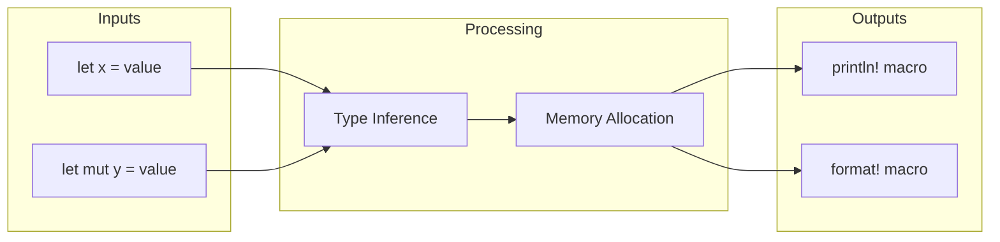

**What MCP generates**: SVG/PNG files from this code

---

### Chapter 3: Ownership
**Diagram Type**: Sequence Diagram

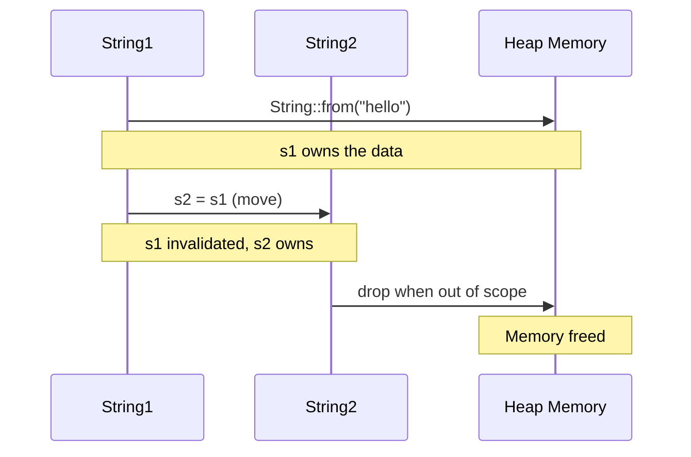

**What MCP generates**: Visual sequence showing ownership transfer

---

### Chapter 4: Control Structures
**Diagram Type**: State Diagram + Flowchart

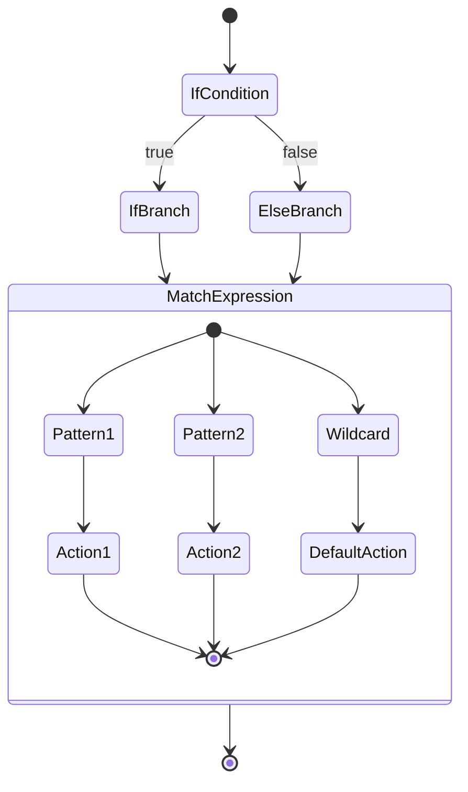

---

### Chapter 5: Stack Project
**Diagram Type**: Git Graph + Class Diagram

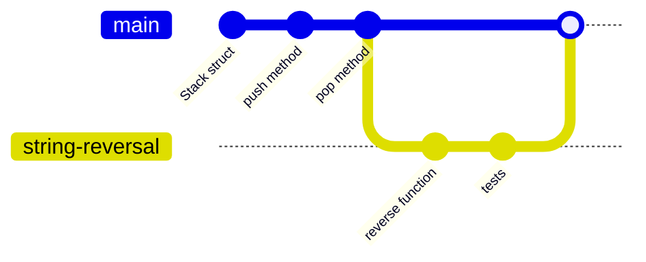

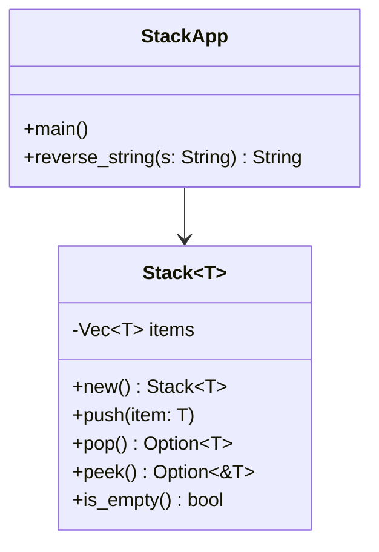

---

### Chapter 6: Structs, Traits, Generics, Enums
**Diagram Type**: Class Diagram + ER Diagram

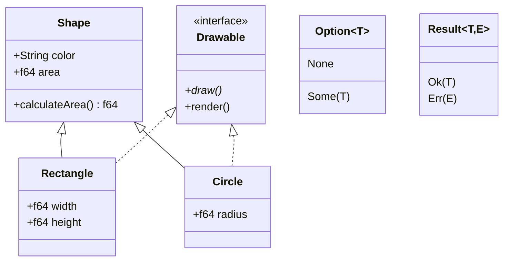

---

### Chapter 7: Iterators, Lifetimes, Closures
**Diagram Type**: Timeline + Sequence Diagram

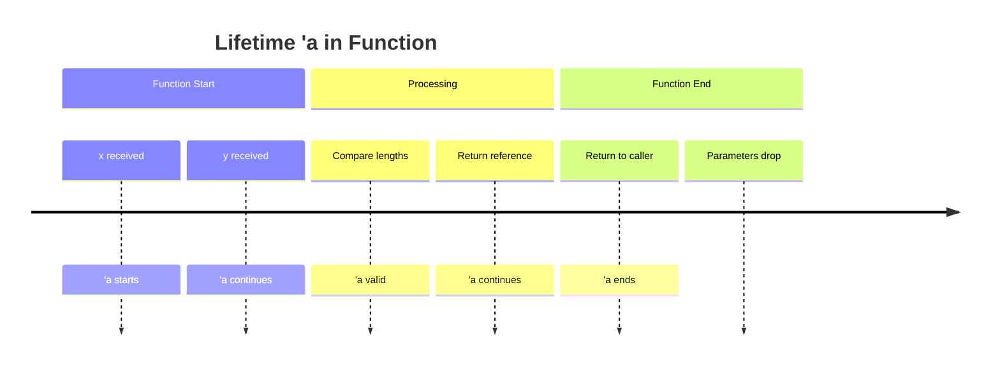

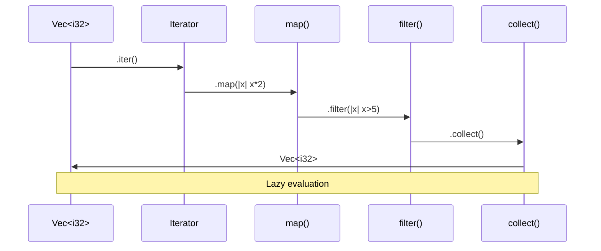

---

### Chapter 8: Modules
**Diagram Type**: ER Diagram + Mindmap

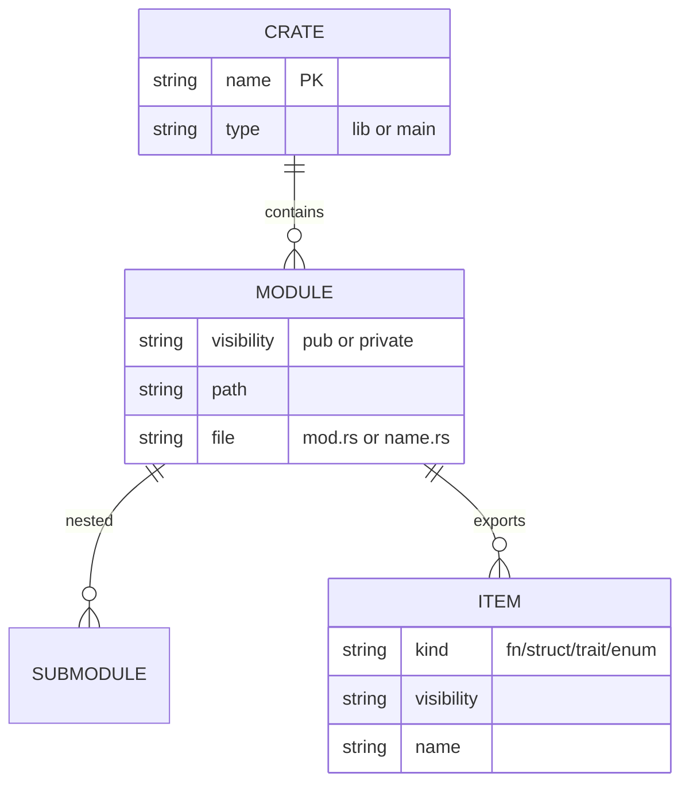

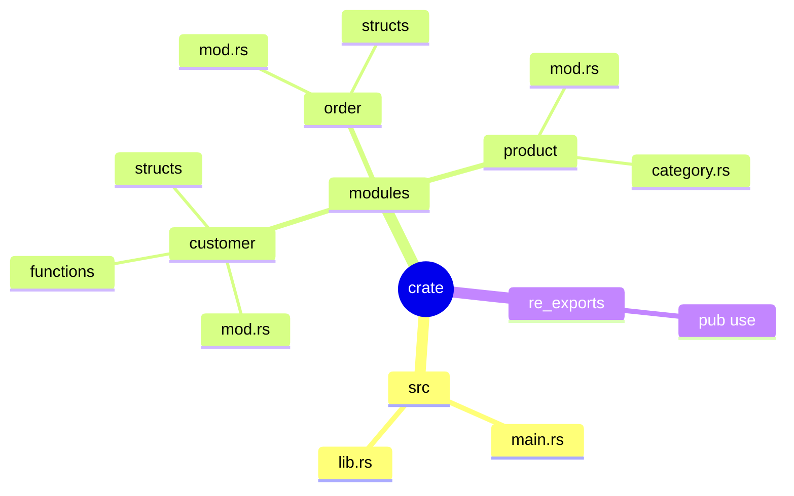

---

### Chapter 9: Smart Pointers
**Diagram Type**: Sequence Diagram + Class Diagram

```mermaid
sequenceDiagram
    participant Box as Box<T>
    participant Rc as Rc<T>
    participant RefCell as RefCell<T>
    participant Heap as Heap Memory
    
    Box->>Heap: Allocate on heap
    Note over Box,Heap: Single ownership
    
    Rc->>Heap: Clone increases count
    Note over Rc,Heap: Reference count = 2
    
    RefCell->>Heap: borrow_mut()
    Note over RefCell,Heap: Runtime borrow check
```

---

### Chapter 14: Concurrency
**Diagram Type**: Mindmap + Sequence Diagram + Gantt

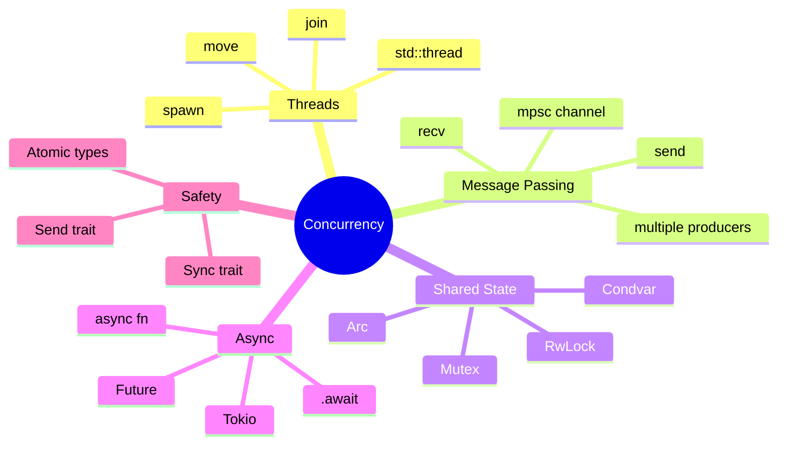

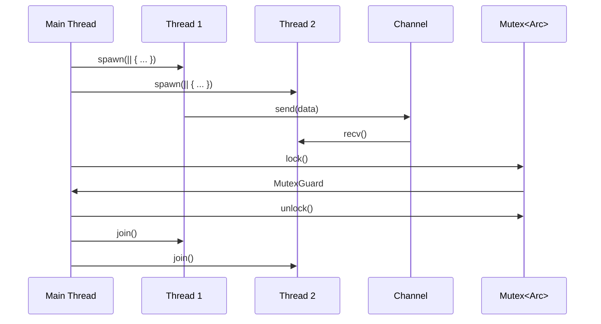

---

## Mermaid MCP Tools Available

Based on the standard Mermaid MCP server implementation, these tools would be available:

| Tool Name | Parameters | Description |
|-----------|------------|-------------|
| `generate_svg` | `code` (string), `output` (string) | Convert Mermaid code to SVG file |
| `generate_png` | `code` (string), `output` (string) | Convert Mermaid code to PNG file |
| `validate` | `code` (string) | Validate Mermaid syntax |
| `get_available_diagrams` | - | List supported diagram types |

## Usage Example with mcp-cli

```bash
# Generate SVG from flowchart
mcp-cli call mermaid generate_svg '{
  "code": "flowchart TD\\nA[Start] --> B{Decision}\\nB -->|Yes| C[Action]",
  "output": "/path/to/diagram.svg"
}'

# Generate PNG from sequence diagram
mcp-cli call mermaid generate_png '{
  "code": "sequenceDiagram\\nAlice->>Bob: Hello",
  "output": "/path/to/diagram.png"
}'

# Validate syntax
mcp-cli call mermaid validate '{
  "code": "flowchart TD\\nA -->"
}'
```

## Integration Workflow

1. **Extract code patterns** from Rust `.txt` or `.rs` files
2. **Map to Mermaid diagram types** (flowchart, sequence, class, etc.)
3. **Generate Mermaid code** using templates
4. **Call Mermaid MCP** to render as SVG/PNG
5. **Embed in documentation** or Obsidian notes

## Benefits Over Excalidraw

| Aspect | Mermaid MCP | Excalidraw |
|--------|-------------|------------|
| **Format** | Text-based (code) | Visual (drawing) |
| **Version Control** | Git-friendly | Binary/large JSON |
| **Automation** | Easy to generate | Manual creation |
| **Editing** | Edit code | Drag & drop |
| **Consistency** | Template-based | Free-form |
| **Best For** | Technical diagrams | Conceptual/visual |

## Recommendation

Use **both**:
- **Mermaid**: For technical diagrams from code (flowcharts, sequence, class, ERD)
- **Excalidraw**: For conceptual diagrams, visual explanations, teaching materials

---

## Next Steps

1. Install Mermaid MCP server: `npm install -g @narasimhaponnada/mermaid-mcp-server`
2. Configure in `~/.config/mcp-cli/mcp_servers.json`
3. Generate diagrams for each chapter
4. Integrate with Obsidian vault
