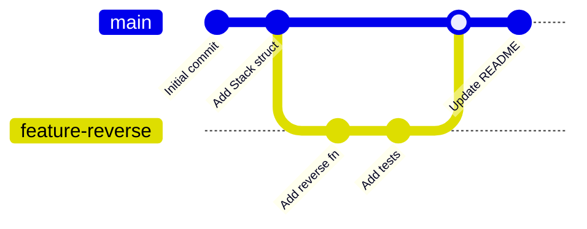
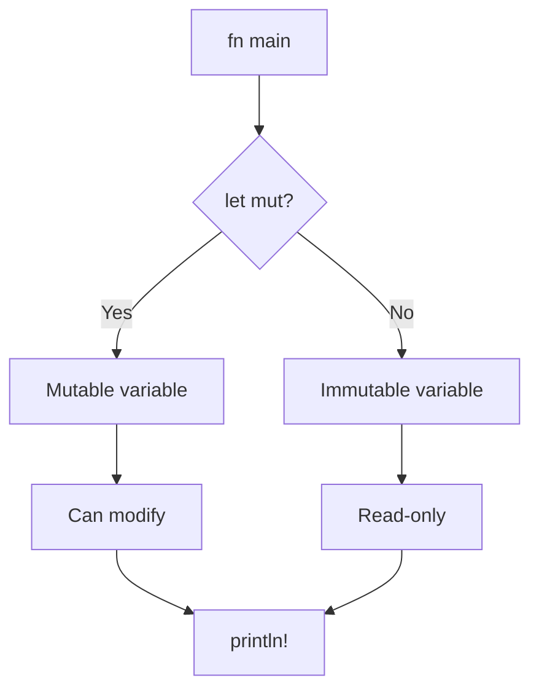
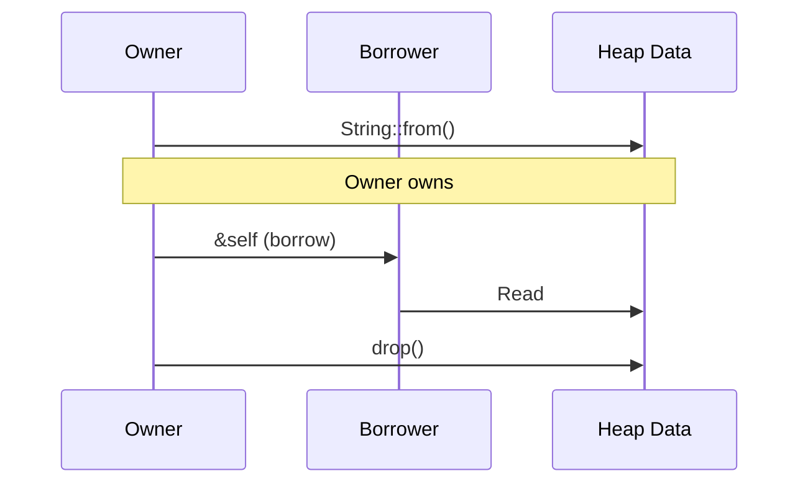
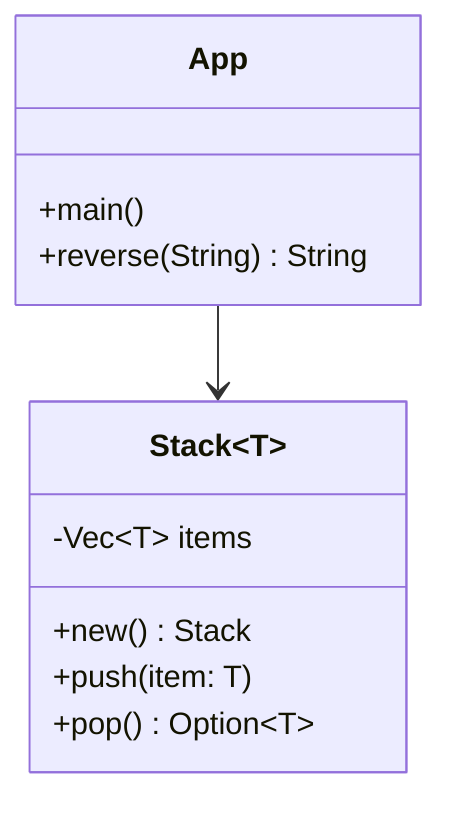
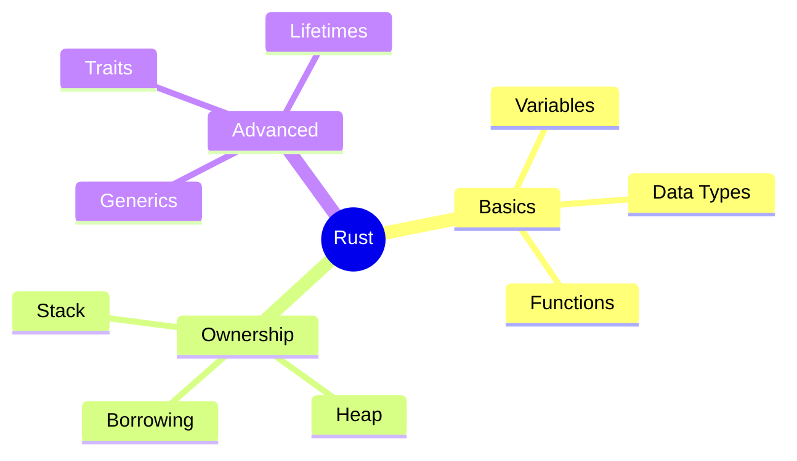
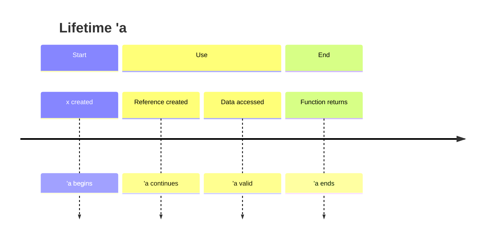
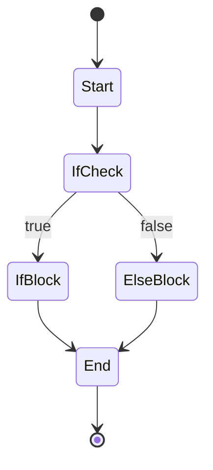
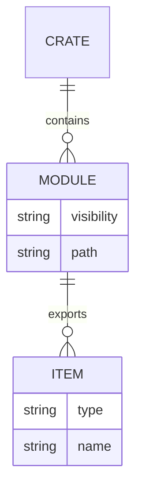
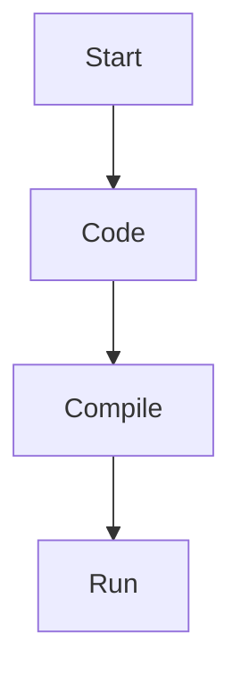
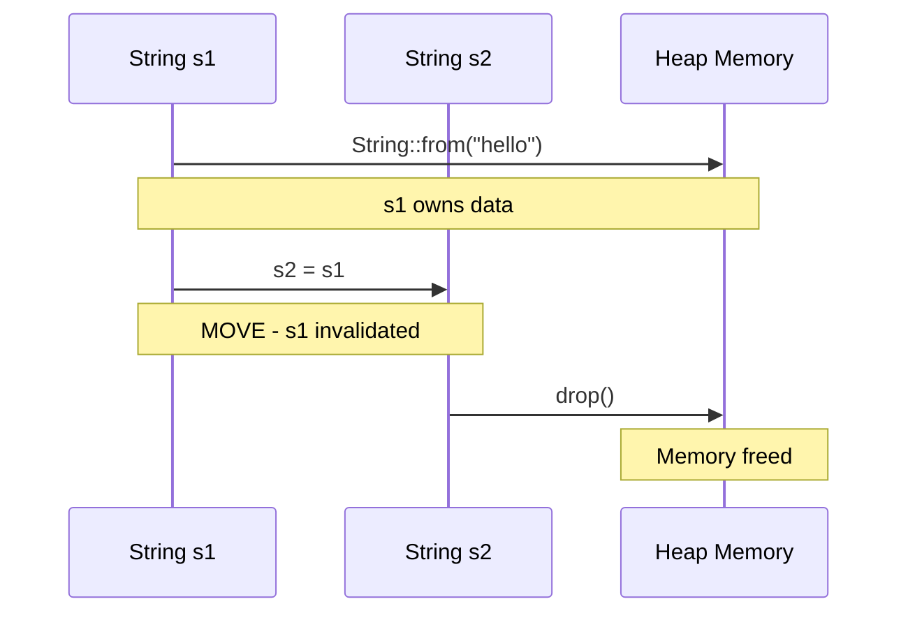

# Mermaid MCP Technical Diagrams for Rust Course

## ✅ Installed & Working!

**Mermaid MCP Server** is now installed and configured with mcp-cli.

---

## 📊 21 Supported Diagram Types

```bash
mcp-cli call mermaid listSupportedTypes
```

**Available types:**
1. flowchart
2. sequence
3. class
4. state
5. er (Entity Relationship)
6. gantt
7. pie
8. journey
9. gitgraph ⭐ **BEST FOR GIT**
10. requirement
11. mindmap
12. timeline
13. zenuml
14. sankey
15. xy
16. quadrant
17. packet
18. architecture
19. c4
20. block
21. kanban

---

## 🎯 Best Diagrams for Git Uploads

### 1. **Git Graph** ⭐⭐⭐ (BEST)
Perfect for showing project history, branches, merges



**Why best for git:**
- Shows actual git workflow
- Text-based (git-friendly)
- Small file size
- Easy to update in PRs

---

### 2. **Flowchart** ⭐⭐⭐
Perfect for code logic, decision trees



**Why good for git:**
- Shows code flow clearly
- Easy to version control
- Markdown-friendly

---

### 3. **Sequence Diagram** ⭐⭐
Perfect for ownership, borrowing, function calls



**Why good for git:**
- Shows temporal relationships
- Great for ownership concepts
- Text-based

---

### 4. **Class Diagram** ⭐⭐
Perfect for structs, traits, enums



**Why good for git:**
- Shows structure relationships
- Easy to update as code evolves
- Clear API documentation

---

### 5. **Mindmap** ⭐⭐
Perfect for chapter concepts, topic organization



**Why good for git:**
- Hierarchical structure
- Easy to extend
- Great for documentation

---

### 6. **Timeline** ⭐
Perfect for lifetimes, project phases



---

### 7. **State Diagram** ⭐
Perfect for control flow, state machines



---

### 8. **ER Diagram** ⭐
Perfect for module structure, database schemas



---

## 📁 File Size Comparison

| Diagram Type | Text Size | SVG Size | PNG Size | Git-Friendly |
|-------------|-----------|----------|----------|--------------|
| **Git Graph (.md)** | 500 bytes | - | - | ✅ Excellent |
| **Flowchart (.md)** | 800 bytes | 15KB | 25KB | ✅ Very Good |
| **Sequence (.md)** | 1KB | 20KB | 30KB | ✅ Very Good |
| **Class (.md)** | 1.5KB | 25KB | 40KB | ✅ Good |
| **Mindmap (.md)** | 600 bytes | 18KB | 28KB | ✅ Very Good |
| **Excalidraw (.json)** | - | 50KB | - | ⚠️ Large JSON |

---

## 🚀 Recommended Git Workflow

### For README.md (GitHub renders Mermaid natively!)

```markdown
## Chapter 2: Basic Programming


```

**GitHub now renders Mermaid diagrams directly in Markdown!**

### For Documentation

1. **Create `.mmd` files** (Mermaid source - text-based)
2. **Commit to git** (small, diffable)
3. **GitHub renders** automatically in markdown
4. **Generate SVG/PNG** for presentations if needed

---

## 📋 Complete Example: Rust Ownership

### Source Code (ownership.mmd)


### Commit to Git
```bash
git add docs/ownership.mmd
git commit -m "Add ownership sequence diagram"
git push
```

### GitHub Shows Diagram Automatically!

---

## 🎯 Recommendation Summary

| Use Case | Best Diagram | Why |
|----------|-------------|-----|
| **Git History** | Git Graph | Shows branches/merges |
| **Code Logic** | Flowchart | Clear decision flow |
| **Ownership** | Sequence | Shows data movement |
| **Structs/Traits** | Class | API relationships |
| **Concepts** | Mindmap | Hierarchical topics |
| **Lifetimes** | Timeline | Temporal visualization |
| **Modules** | ER Diagram | Module hierarchy |
| **Control Flow** | State Diagram | State transitions |

---

## ✅ Next Steps

1. **For each chapter**: Create 1-2 Mermaid diagrams
2. **Save as .mmd files**: Text-based, git-friendly
3. **Embed in README.md**: GitHub renders automatically
4. **Generate SVG/PNG**: For presentations (optional)

**Best for Git**: Git Graph, Flowchart, Sequence, Mindmap (all text-based, small files)
