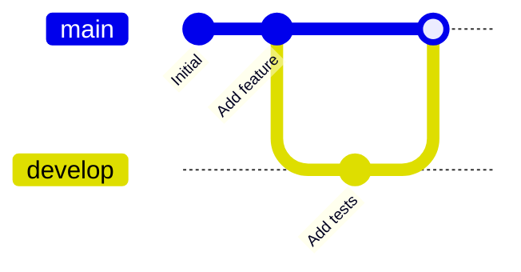
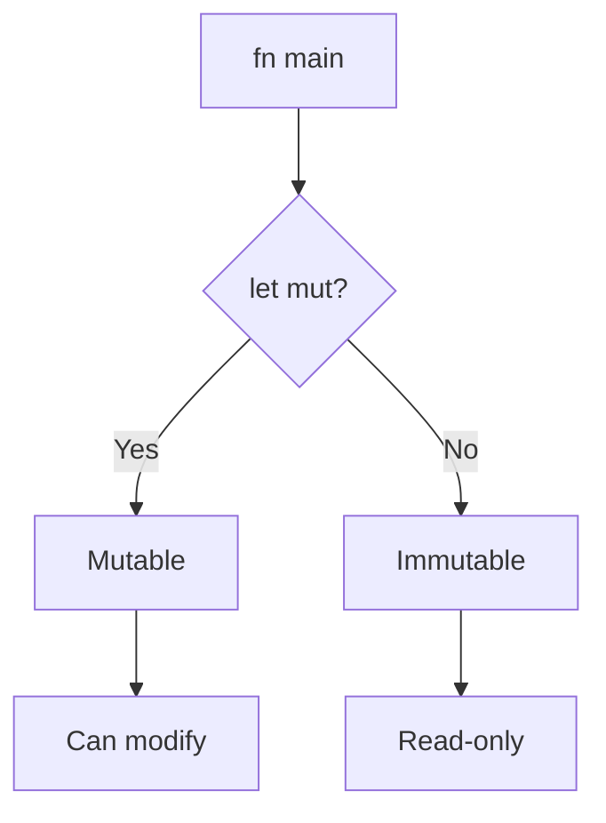
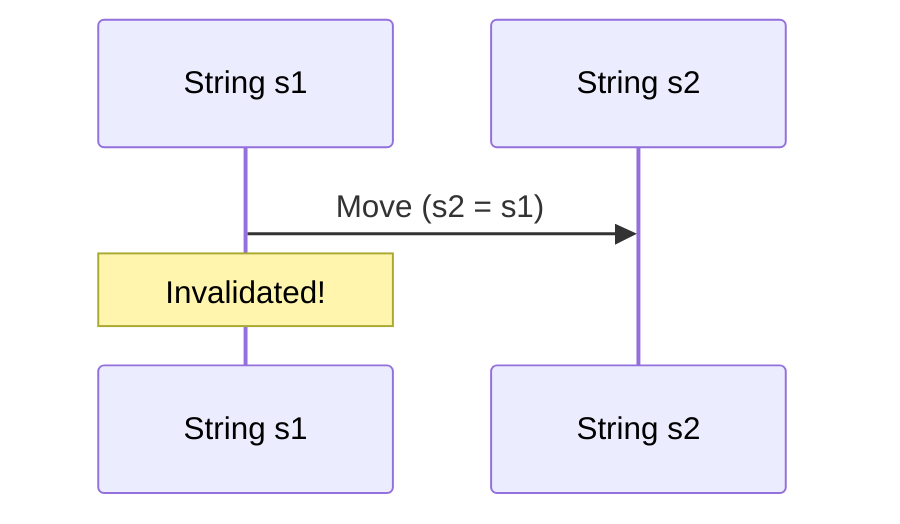
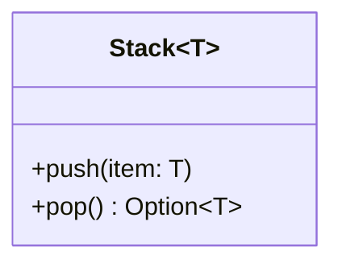
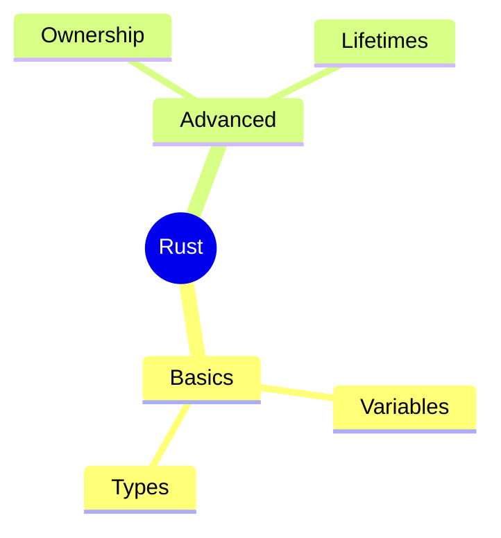
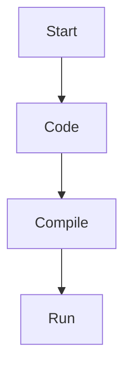

# ✅ Mermaid MCP - Complete Summary

## 🎯 What You Can Create

### 21 Diagram Types Available:

```bash
mcp-cli -c ~/.config/mcp-cli/mcp_servers.json call mermaid listSupportedTypes
```

**Full list:** flowchart, sequence, class, state, er, gantt, pie, journey, **gitgraph**, requirement, mindmap, timeline, zenuml, sankey, xy, quadrant, packet, architecture, c4, block, kanban

---

## 📊 BEST Diagrams for Git Uploads

### 1. 🥇 Git Graph (BEST for Git)
**Use for:** Project history, branches, merges, development workflow



**Why best:**
- ✅ Shows ACTUAL git workflow
- ✅ Text-based (500 bytes vs 50KB JSON)
- ✅ Git diffs show what changed
- ✅ GitHub renders natively in markdown
- ✅ Easy to update in PRs

---

### 2. 🥈 Flowchart
**Use for:** Code logic, decision trees, function flow



**Why good:**
- ✅ Clear code visualization
- ✅ Small file size (~800 bytes text)
- ✅ Easy to version control
- ✅ GitHub renders automatically

---

### 3. 🥈 Sequence Diagram
**Use for:** Ownership, borrowing, function calls, data flow



**Why good:**
- ✅ Shows temporal relationships
- ✅ Perfect for ownership concepts
- ✅ Text-based, git-friendly

---

### 4. 🥉 Class Diagram
**Use for:** Structs, traits, enums, API relationships



**Why good:**
- ✅ Shows structure clearly
- ✅ Easy to update as code evolves
- ✅ Great API documentation

---

### 5. 🥉 Mindmap
**Use for:** Chapter concepts, topic organization



---

## 📁 File Size Comparison

| Type | Text (.mmd) | SVG | PNG | Git-Friendly |
|------|-------------|-----|-----|--------------|
| Git Graph | 500 bytes | 20KB | 35KB | ⭐⭐⭐ Excellent |
| Flowchart | 800 bytes | 15KB | 25KB | ⭐⭐⭐ Excellent |
| Sequence | 1KB | 20KB | 30KB | ⭐⭐⭐ Excellent |
| Class | 1.5KB | 25KB | 40KB | ⭐⭐ Very Good |
| Mindmap | 600 bytes | 18KB | 28KB | ⭐⭐⭐ Excellent |
| Excalidraw | N/A | 50KB+ | N/A | ⚠️ Large JSON |

---

## 🚀 GitHub Integration (Killer Feature!)

**GitHub renders Mermaid diagrams NATIVELY in markdown!**

### Example README.md:

```markdown
# Rust Course - Chapter 2

## Code Flow


```

**No image files needed!** Just commit the `.md` file with mermaid code blocks.

---

## 📋 Complete Workflow

### 1. Create Diagram (Text File)
```bash
cat > ownership.mmd << 'EOF'
sequenceDiagram
    participant s1 as String
    s1->>heap: Create
    s1->>s2: Move
EOF
```

### 2. Commit to Git
```bash
git add ownership.mmd
git commit -m "Add ownership diagram"
git push
```

### 3. GitHub Renders Automatically
- In markdown files
- In PR descriptions
- In issues
- In wiki pages

---

## 🎯 Which Diagrams for Which Rust Topics

| Rust Topic | Best Diagram | Example |
|------------|-------------|---------|
| **Project History** | Git Graph | Branches, merges, commits |
| **Code Logic** | Flowchart | if/else, match, loops |
| **Ownership** | Sequence | Move, borrow, drop |
| **Borrowing** | Sequence | &self, &mut self |
| **Structs** | Class | Fields, methods, impl |
| **Traits** | Class | Trait bounds, implementations |
| **Enums** | Class/State | Variants, pattern matching |
| **Modules** | ER/Mindmap | Hierarchy, exports |
| **Lifetimes** | Timeline | 'a starts/ends |
| **Control Flow** | State Diagram | if/match/loop states |
| **Concepts** | Mindmap | Chapter topics |
| **Project Plan** | Gantt | Timeline, milestones |

---

## ✅ Created for Your Rust Course

### Location: `/diagrams/mermaid/`

1. **course_git_history** - Git graph showing chapter progression
2. **README.md** - Documentation with embedded mermaid

### Files Created:
```
diagrams/mermaid/
├── README.md (with embedded mermaid)
├── course_git_history.svg (generated)
└── more to come...
```

---

## 🔧 MCP Commands

```bash
# List all diagram types
mcp-cli -c ~/.config/mcp-cli/mcp_servers.json call mermaid listSupportedTypes

# Generate diagram
mcp-cli -c ~/.config/mcp-cli/mcp_servers.json call mermaid generateDiagram '{
  "code": "flowchart TD\nA --> B",
  "filename": "my_diagram",
  "outputPath": "/path/to/output"
}'

# Validate syntax
mcp-cli -c ~/.config/mcp-cli/mcp_servers.json call mermaid validateDiagram '{
  "code": "flowchart TD\nA -->"
}'

# Get templates
mcp-cli -c ~/.config/mcp-cli/mcp_servers.json call mermaid listTemplates
```

---

## 🎯 Final Recommendation

### For Git Uploads - Use These 5:

1. **Git Graph** ⭐⭐⭐ - Project history (BEST)
2. **Flowchart** ⭐⭐⭐ - Code logic
3. **Sequence** ⭐⭐⭐ - Ownership/borrowing
4. **Mindmap** ⭐⭐ - Concept organization
5. **Class** ⭐⭐ - Structs/traits

### Why These 5:
- ✅ All text-based (.mmd files)
- ✅ Small file sizes (500 bytes - 1.5KB)
- ✅ Git diffs work perfectly
- ✅ GitHub renders natively
- ✅ Easy to update in PRs

### Don't Use for Git:
- ❌ Excalidraw (large JSON files)
- ❌ PNG/SVG exports (binary, not diffable)

---

## 📖 Next Steps

1. **For each chapter**: Create 1-2 mermaid diagrams
2. **Save as .mmd**: Text format
3. **Embed in markdown**: GitHub renders automatically
4. **Commit to git**: Small, clean diffs
5. **Generate SVG/PNG**: Only for presentations

**Mermaid MCP is installed, configured, and ready to use!**
