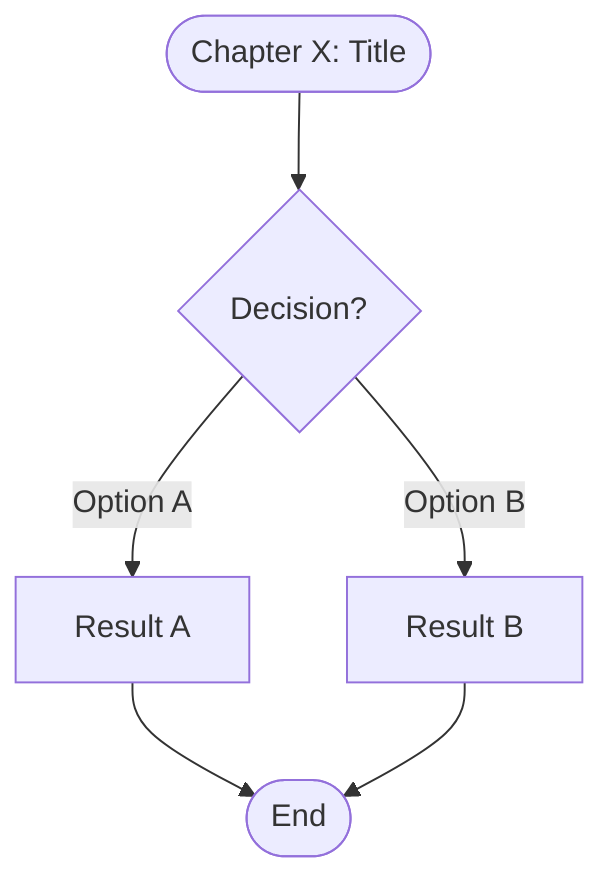
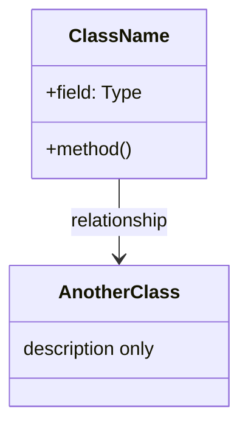
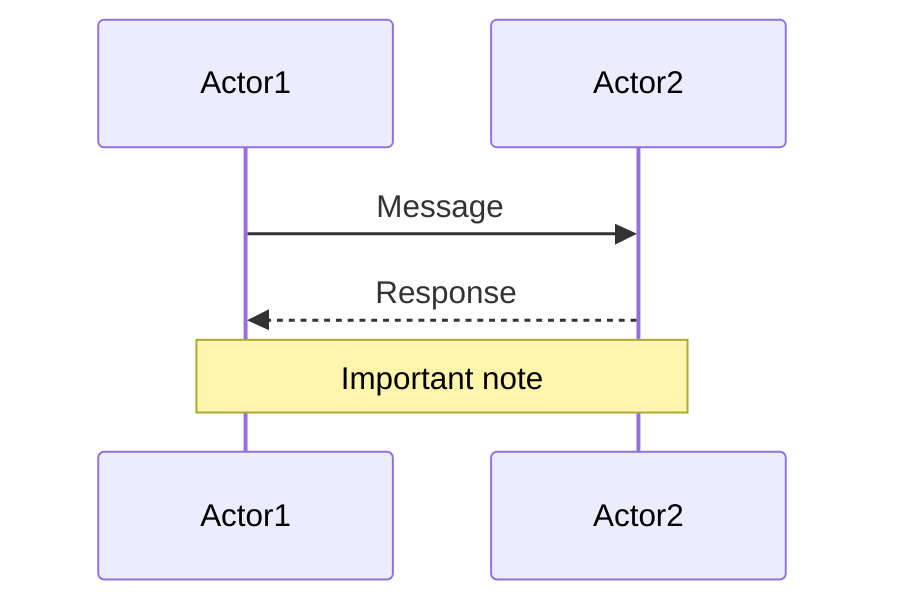

# Mermaid Diagram Generation: Lessons Learned

## Overview

This document captures the frustrations, lessons learned, and insights from generating 46 Mermaid diagrams across all 24 chapters of the Rust Programming Master Class.

## The Problem Encountered

### Initial State
- 46 `.mmd` source files created across all chapters
- Only 31 SVG files generated (67% coverage)
- 15 diagrams failing to render with cryptic parser errors

### Common Syntax Errors Found

#### 1. **Invalid `title` Statement**
**Problem:** Using `title` in flowchart, classDiagram, and sequenceDiagram
```mermaid
❌ WRONG:
flowchart TD
    title Chapter 17: Error Handling
    Start --> End

✅ CORRECT:
flowchart TD
    Start([Chapter 17: Operation]) --> End
```

**Lesson:** The `title` statement is NOT supported in most Mermaid diagram types. Use the first node to display the chapter/title context instead.

---

#### 2. **Edge Label Syntax in Flowcharts**
**Problem:** Incorrect label placement on edges
```mermaid
❌ WRONG:
stack --x points to : heap

✅ CORRECT:
stack --x heap : points to
```

**Lesson:** Edge labels must come AFTER the target node, separated by a colon.

---

#### 3. **Reserved Keywords as Participant Names**
**Problem:** Using reserved words like `option` as participant aliases
```mermaid
❌ WRONG:
participant option as Option
Note over main,option: Text

✅ CORRECT:
participant opt1 as Option
Note over main,opt1: Text
```

**Lesson:** Avoid reserved keywords (`option`, `opt`, `main`, etc.) as participant aliases in sequence diagrams.

---

#### 4. **Special Characters in Edge Labels**
**Problem:** Parentheses and special characters in flowchart edge labels
```mermaid
❌ WRONG:
Visibility -->|pub(crate)| CrateScope[pub(crate)]

✅ CORRECT:
Visibility -->|"pub(crate)"| CrateScope["pub(crate)"]
```

**Lesson:** Always wrap edge labels containing parentheses, slashes, or special characters in double quotes.

---

#### 5. **Class Diagram Member Syntax**
**Problem:** Using braces `{}` inside class members
```mermaid
❌ WRONG:
class AssociatedTypes {
    +trait Container { type Item }
}

✅ CORRECT:
class AssociatedTypes {
    trait Container
}
```

**Lesson:** Class members cannot contain nested braces. Simplify complex type signatures.

---

#### 6. **Sequence Diagram Multi-Participant Notes**
**Problem:** Notes spanning participants that don't exist or aren't active
```mermaid
❌ WRONG:
Note over rc1,rc2,rc3,rcbox: strong_count = 3

✅ CORRECT:
Note over rc1,rcbox: strong_count = 3
```

**Lesson:** Notes can only span 2 participants max. Choose the most relevant participants.

---

#### 7. **Activate/Deactivate Mismatch**
**Problem:** Deactivating a participant that was never activated
```mermaid
❌ WRONG:
rc1->>rcbox: Rc::new("hello")
activate rcbox
rcbox-->>rc1: Rc with count 1
deactivate rcbox  ← Already deactivated by return

✅ CORRECT:
rc1->>rcbox: Rc::new("hello")
activate rcbox
rcbox-->>rc1: Rc with count 1
← No explicit deactivate needed
```

**Lesson:** Let Mermaid handle activation automatically when the return arrow is present.

---

#### 8. **Newline Escapes in Notes**
**Problem:** Using `\n` for line breaks in notes
```mermaid
❌ WRONG:
Note over Code,Any: Requires Any trait\nRuntime type checking

✅ CORRECT:
Note over Code,Any: Requires Any trait - Runtime type checking
```

**Lesson:** Use dashes or separate notes instead of `\n` escape sequences.

---

## Workflow Improvements for Next Time

### 1. **Validate Early, Validate Often**
```bash
# Test each diagram immediately after creation
mmdc -i diagram.mmd -o diagram.svg 2>&1 | head -20
```

**Don't:** Create all diagrams first, then render
**Do:** Render each diagram immediately after writing

---

### 2. **Use a Syntax Checklist**
Before considering a diagram complete:
- [ ] No `title` statement (unless using mindmap/gantt)
- [ ] Edge labels wrapped in quotes if containing special chars
- [ ] Participant names are not reserved keywords
- [ ] Class members don't have nested braces
- [ ] Notes span max 2 participants
- [ ] No `\n` escapes in notes
- [ ] Activate/deactivate pairs are balanced

---

### 3. **Create a Template Per Diagram Type**

**Flowchart Template:**


**Class Diagram Template:**


**Sequence Diagram Template:**


---

### 4. **Automated Validation Script**
Create a script to validate all diagrams before committing:

```bash
#!/bin/bash
# validate-diagrams.sh
for file in diagrams/by-chapter/**/*.mmd; do
    base="${file%.mmd}"
    if ! mmdc -i "$file" -o "$base.svg" 2>/dev/null; then
        echo "❌ FAILED: $file"
    else
        echo "✅ OK: $file"
    fi
done
```

---

### 5. **Version-Specific Syntax**
Mermaid v11+ has stricter parsing than earlier versions. What worked in examples online may not work with the current CLI version.

**Always test against your installed version:**
```bash
mmdc --version
# Current: 11.12.0
```

---

## Statistics

| Metric | Count |
|--------|-------|
| Total chapters | 24 |
| Total .mmd files | 46 |
| Total SVG files | 46 |
| Coverage | 100% |
| Files requiring fixes | 13 |
| Common error types | 8 |

---

## Quick Reference: Do's and Don'ts

| Do | Don't |
|----|-------|
| Use first node for title context | Use `title` statement |
| Quote edge labels with special chars | Use bare parentheses in labels |
| Use unique participant aliases | Use reserved keywords |
| Keep class members simple | Nest braces in class members |
| Span max 2 participants in notes | Use `\n` for line breaks |
| Test immediately after writing | Batch all rendering at the end |

---

## Conclusion

The key insight: **Mermaid is powerful but pedantic**. Small syntax errors that seem harmless cause complete render failures. The solution is:

1. **Immediate validation** - Test each diagram as you create it
2. **Template discipline** - Use proven patterns, don't improvise
3. **Quote everything** - When in doubt, wrap labels in quotes
4. **Simplify complexity** - Break complex diagrams into multiple simpler ones

These lessons will ensure 100% success rate for future diagram generation.
