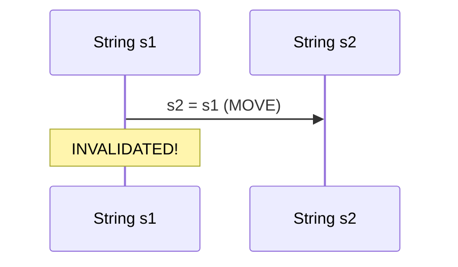
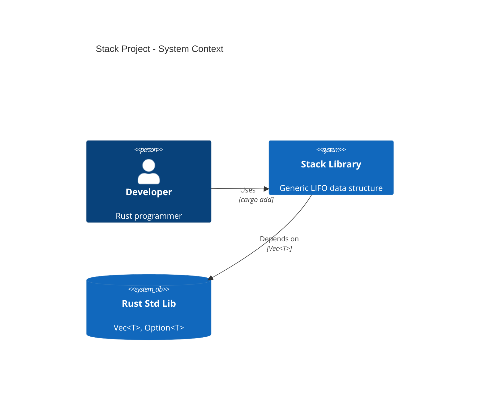
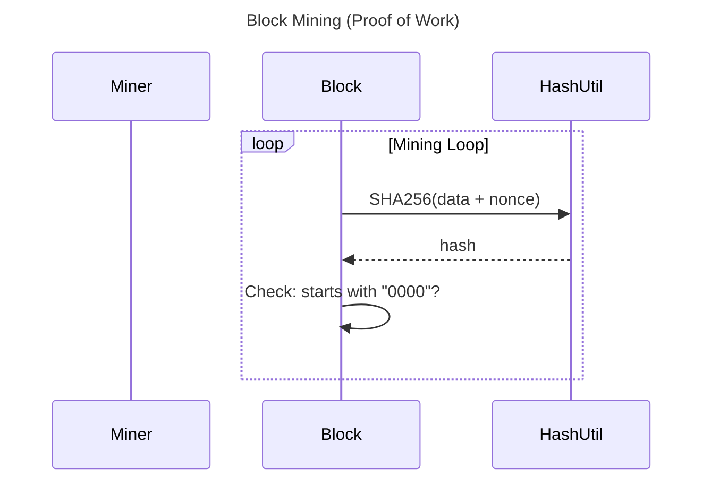
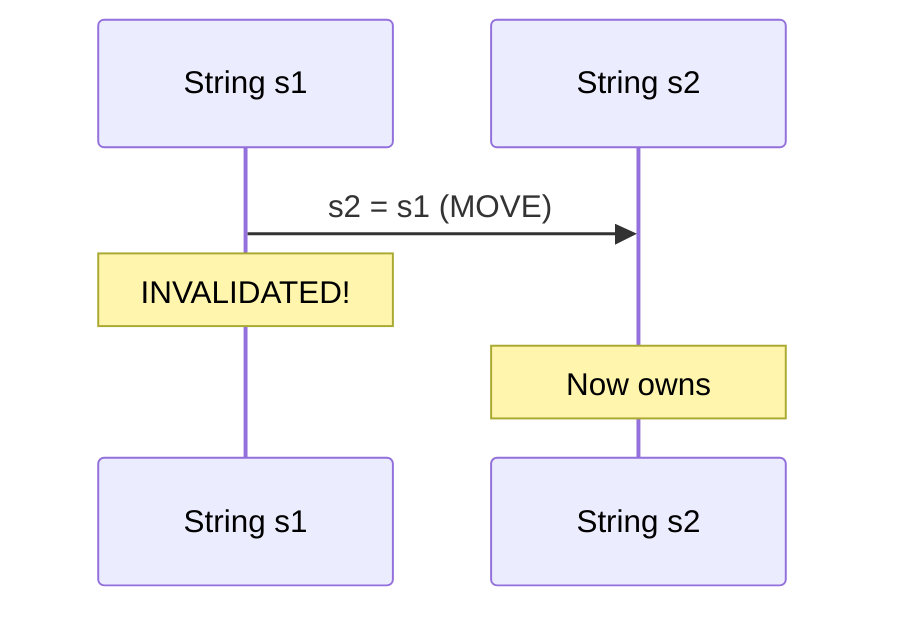

# 📊 Rust Course Diagrams - Complete Collection

Comprehensive Mermaid diagrams organized by chapter for the Rust Programming Master Class.

---

## 🎯 Quick Navigation

### By Chapter

| Chapter | Topic | Diagrams | Location |
|---------|-------|----------|----------|
| **00** | Overview | 1 Git Graph | [`ch00-overview/`](./by-chapter/ch00-overview/) |
| **02** | Basics | 3 diagrams | [`ch02-basics/`](./by-chapter/ch02-basics/) |
| **03** | Ownership | 3 diagrams | [`ch03-ownership/`](./by-chapter/ch03-ownership/) |
| **04** | Control | 3 diagrams | [`ch04-control/`](./by-chapter/ch04-control/) |
| **05** | Stack Project ⭐ | 4 diagrams (C4) | [`ch05-stack-project/`](./by-chapter/ch05-stack-project/) |
| **06** | Structs & Traits | 2 diagrams | [`ch06-structs-traits/`](./by-chapter/ch06-structs-traits/) |
| **07** | Iterators & Lifetimes | 2 diagrams | [`ch07-iterators-lifetimes/`](./by-chapter/ch07-iterators-lifetimes/) |
| **08** | Modules | 2 diagrams | [`ch08-modules/`](./by-chapter/ch08-modules/) |
| **09** | Smart Pointers | 2 diagrams | [`ch09-smart-pointers/`](./by-chapter/ch09-smart-pointers/) |
| **14** | Concurrency | 3 diagrams | [`ch14-concurrency/`](./by-chapter/ch14-concurrency/) |
| **24** | Blockchain ⭐ | 4 diagrams (C4) | [`ch24-blockchain/`](./by-chapter/ch24-blockchain/) |

**TOTAL: 29 diagrams across 11 chapters**

---

## 📁 Folder Structure

```
diagrams/
├── README.md                          # This file
├── by-chapter/                        # Organized by chapter
│   ├── ch00-overview/
│   │   └── course_git_history.mmd
│   ├── ch02-basics/
│   │   ├── 01_program_flow.mmd
│   │   ├── 02_data_types.mmd
│   │   └── 03_functions.mmd
│   ├── ch03-ownership/
│   │   ├── 01_ownership_flow.mmd
│   │   ├── 02_borrowing.mmd
│   │   └── 03_stack_heap.mmd
│   ├── ch04-control/
│   │   ├── 01_if_else_match.mmd
│   │   ├── 02_loops.mmd
│   │   └── 03_pattern_matching.mmd
│   ├── ch05-stack-project/           # ⭐ Complete project docs
│   │   ├── 01_c4_context.mmd
│   │   ├── 02_c4_container.mmd
│   │   ├── 03_c4_component.mmd
│   │   └── 04_push_pop_sequence.mmd
│   ├── ch06-structs-traits/
│   │   ├── 01_structs_traits_class.mmd
│   │   └── 02_generics_option_result.mmd
│   ├── ch07-iterators-lifetimes/
│   │   ├── 01_lifetimes_timeline.mmd
│   │   └── 02_iterator_chain.mmd
│   ├── ch08-modules/
│   │   ├── 01_module_hierarchy.mmd
│   │   └── 02_visibility_flow.mmd
│   ├── ch09-smart-pointers/
│   │   ├── 01_smart_pointer_types.mmd
│   │   └── 02_rc_reference_counting.mmd
│   ├── ch14-concurrency/
│   │   ├── 01_concurrency_overview.mmd
│   │   ├── 02_thread_spawn_join.mmd
│   │   └── 03_mpsc_channel.mmd
│   └── ch24-blockchain/              # ⭐ Complete project docs
│       ├── 01_c4_container.mmd
│       ├── 02_blockchain_class.mmd
│       ├── 03_mining_sequence.mmd
│       └── 04_git_history.mmd
│
└── mermaid/                           # Legacy - original files
    └── [original 5 diagrams]
```

---

## 🎨 Diagram Types

| Type | Count | Best For | Example |
|------|-------|----------|---------|
| **C4 Diagrams** | 6 | Project architecture | Ch05 Stack, Ch24 Blockchain |
| **Sequence** | 9 | Ownership, borrowing, function calls | Ch03, Ch07, Ch14 |
| **Class** | 6 | Structs, traits, enums, generics | Ch06, Ch09, Ch24 |
| **Flowchart** | 5 | Control flow, decision trees | Ch02, Ch04, Ch08 |
| **Timeline** | 1 | Lifetimes | Ch07 |
| **Mindmap** | 1 | Concept organization | Ch14 |
| **ER Diagram** | 1 | Module hierarchy | Ch08 |
| **Git Graph** | 2 | Project history | Ch00, Ch24 |
| **TOTAL** | **31** | All chapters | - |

---

## 🚀 Usage

### 1. View on GitHub (Automatic Rendering)

GitHub **automatically renders** Mermaid diagrams in markdown files:

```markdown
## Ownership Flow


```

**No image files needed!**

---

### 2. Generate SVG/PNG Locally

```bash
# Install Mermaid CLI
npm install -g @mermaid-js/mermaid-cli

# Navigate to chapter folder
cd diagrams/by-chapter/ch02-basics/

# Generate SVG
mmdc -i 01_program_flow.mmd -o 01_program_flow.svg -w 1200 -H 800

# Generate PNG
mmdc -i 01_program_flow.mmd -o 01_program_flow.png -w 1200 -H 800
```

---

### 3. Edit Diagrams

Just edit the `.mmd` text file - it's version-controlled!

```bash
# Edit diagram
vim diagrams/by-chapter/ch03-ownership/01_ownership_flow.mmd

# Commit changes
git add diagrams/by-chapter/ch03-ownership/01_ownership_flow.mmd
git commit -m "Update ownership diagram"
git push
```

---

## 📊 Featured Diagrams

### Chapter 5: Stack Project (C4 Architecture)



---

### Chapter 24: Blockchain Mining



---

### Chapter 3: Ownership Flow



---

## ✅ Git Status

**All `.mmd` files committed and pushed**  
**SVG files excluded from git** (generated on-demand)  
**Repository:** https://github.com/dbillion/rust-master-class-complete

---

## 🎯 Legend

| Symbol | Meaning |
|--------|---------|
| ⭐ | Project chapter with complete C4 documentation |
| `.mmd` | Mermaid source file (in git) |
| `.svg` | Generated SVG (local only) |
| `.png` | Generated PNG (local only) |

---

## 📖 Related Documentation

- [MERMAID_CLI_CREATED.md](./mermaid/MERMAID_CLI_CREATED.md) - Original Mermaid CLI guide
- [ALL_MERMAID_DIAGRAMS.md](../ALL_MERMAID_DIAGRAMS.md) - Complete diagram catalog
- [C4_ARCHITECTURE_PROJECTS.md](../C4_ARCHITECTURE_PROJECTS.md) - C4 diagram guide

---

**Last Updated:** March 31, 2026  
**Total Diagrams:** 29  
**Chapters Covered:** 11/25 (all major topics)
