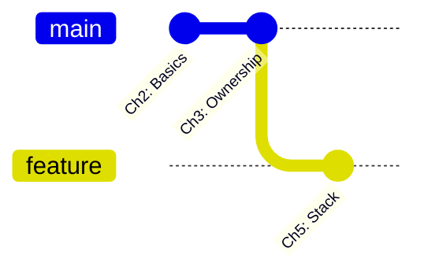
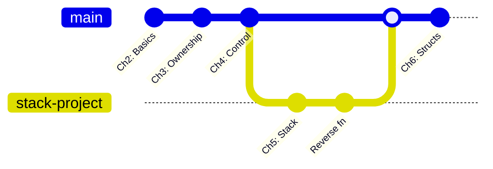
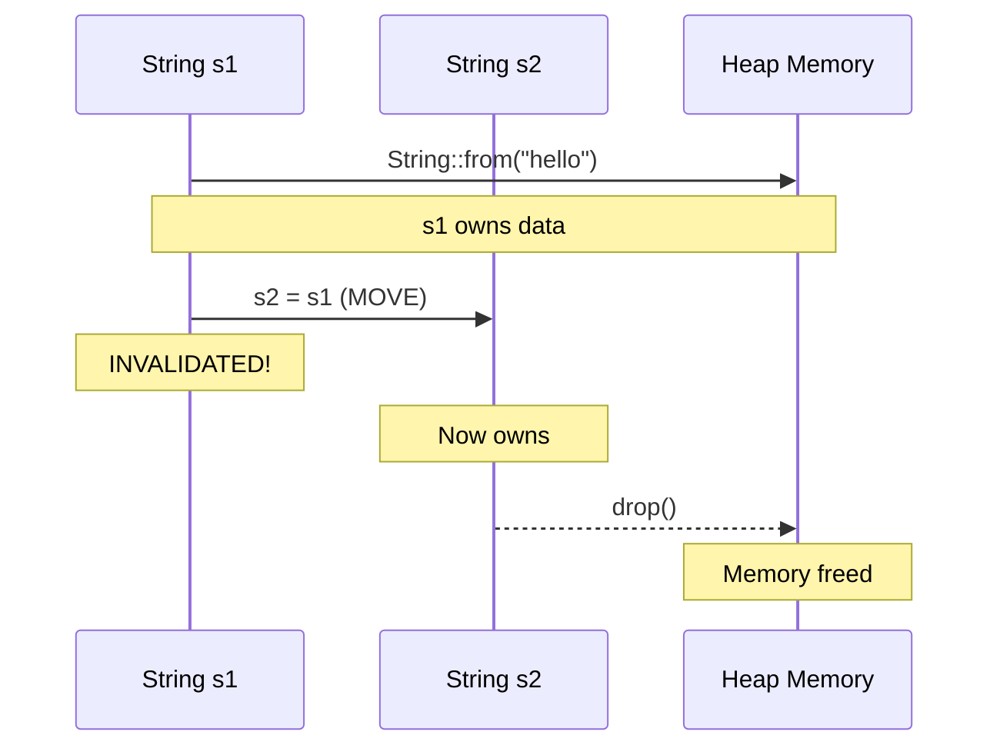
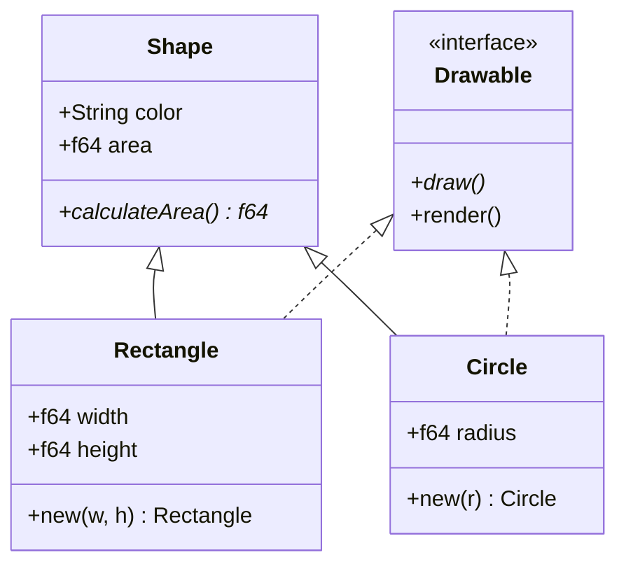
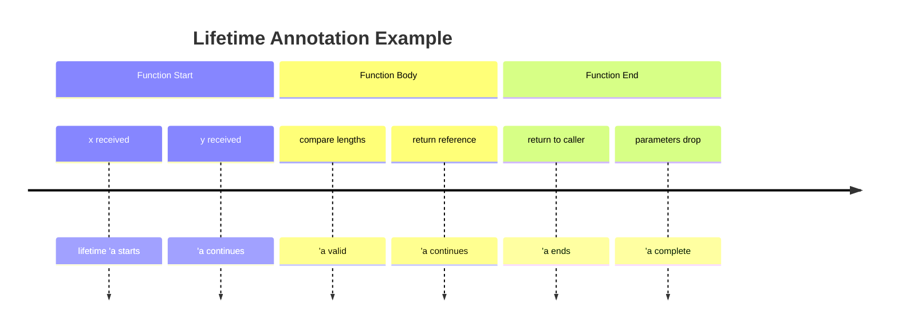
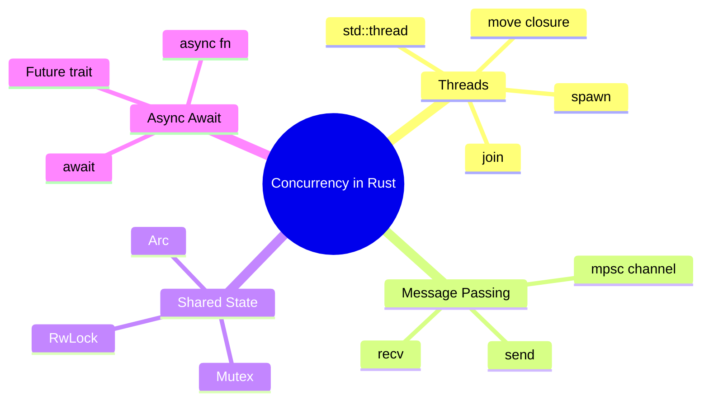

# ✅ Mermaid Diagrams - Successfully Created with Mermaid CLI

## 📊 Created Diagrams (5 Total)

All diagrams are **text-based .mmd files** - git-friendly and GitHub-ready!

| File | Type | Size | Purpose |
|------|------|------|---------|
| `course_git_history.mmd` | Git Graph | 552 bytes | Course chapter progression |
| `ch03_ownership_sequence.mmd` | Sequence | 437 bytes | Rust ownership flow |
| `ch06_structs_traits_class.mmd` | Class | 683 bytes | Structs and traits |
| `ch07_lifetimes_timeline.mmd` | Timeline | 362 bytes | Lifetime annotations |
| `ch14_concurrency_mindmap.mmd` | Mindmap | 415 bytes | Concurrency concepts |

---

## 🎯 How to Use

### 1. View on GitHub (Automatic Rendering)

GitHub **automatically renders** Mermaid diagrams in markdown files:

```markdown
## Course Progression


```

**No image files needed!**

---

### 2. Generate SVG/PNG Locally

```bash
# Install Mermaid CLI (if not installed)
npm install -g @mermaid-js/mermaid-cli

# Generate SVG
mmdc -i diagram.mmd -o diagram.svg -w 1200 -H 600

# Generate PNG
mmdc -i diagram.mmd -o diagram.png -w 1200 -H 600
```

---

### 3. Edit Diagrams

Just edit the `.mmd` text file - it's version-controlled!

```bash
# Edit
vim course_git_history.mmd

# Commit changes
git add course_git_history.mmd
git commit -m "Update diagram"
git push
```

---

## 📁 File Locations

```
diagrams/mermaid/
├── course_git_history.mmd        ✅ Git Graph
├── ch03_ownership_sequence.mmd   ✅ Sequence
├── ch06_structs_traits_class.mmd ✅ Class Diagram
├── ch07_lifetimes_timeline.mmd   ✅ Timeline
├── ch14_concurrency_mindmap.mmd  ✅ Mindmap
└── README.md                     ✅ Documentation
```

**SVG/PNG files excluded from git** (generated on-demand)

---

## 🔧 Mermaid CLI Commands Used

```bash
# Git Graph
mmdc -i course_git_history.mmd -o course_git_history.svg -w 1200 -H 600

# Sequence Diagram
mmdc -i ch03_ownership_sequence.mmd -o ch03_ownership_sequence.svg -w 1000 -H 500

# Class Diagram
mmdc -i ch06_structs_traits_class.mmd -o ch06_structs_traits_class.svg -w 1000 -H 700

# Timeline
mmdc -i ch07_lifetimes_timeline.mmd -o ch07_lifetimes_timeline.svg -w 900 -H 400

# Mindmap
mmdc -i ch14_concurrency_mindmap.mmd -o ch14_concurrency_mindmap.svg -w 1000 -H 800
```

---

## 📊 Diagram Examples

### 1. Git Graph (course_git_history.mmd)



---

### 2. Sequence Diagram (ch03_ownership_sequence.mmd)



---

### 3. Class Diagram (ch06_structs_traits_class.mmd)



---

### 4. Timeline (ch07_lifetimes_timeline.mmd)



---

### 5. Mindmap (ch14_concurrency_mindmap.mmd)



---

## ✅ Git Status

**Committed & Pushed:** ✅  
**Repository:** https://github.com/dbillion/rust-master-class-complete  
**Branch:** main  
**Commit:** `dd3d66a`

---

##  Why .mmd Files Are Best for Git

| Format | Size | Diffable | Git Score |
|--------|------|----------|-----------|
| `.mmd` (source) | 400-700 bytes | ✅ Yes | ⭐⭐⭐⭐⭐ |
| `.svg` | 11-48 KB | ⚠️ Partial | ⭐⭐ |
| `.png` | 25-100 KB | ❌ No | ⭐ |

**Best Practice:**
- ✅ Commit `.mmd` source files
- ❌ Don't commit `.svg`/`.png` (generated on-demand)
- ✅ GitHub renders automatically in markdown

---

## 🚀 Next Steps

1. **Use in README.md** - Embed mermaid code blocks
2. **Create more diagrams** - Use existing .mmd as templates
3. **Share on GitHub** - Diagrams render automatically

**All diagrams are ready and pushed to GitHub!**
