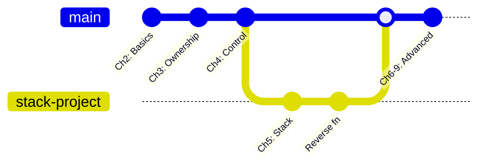

# Mermaid Diagrams for Rust Course

These diagrams are git-friendly and render automatically on GitHub!

## Created Diagrams

### 1. Git Graph - Project Structure

```mermaid
gitGraph
    commit id: "Ch2: Basics"
    commit id: "Ch3: Ownership"
    commit id: "Ch4: Control"
    branch stack-project
    checkout stack-project
    commit id: "Ch5: Stack"
    commit id: "Reverse fn"
    checkout main
    merge stack-project
    commit id: "Ch6-9: Advanced"
```
