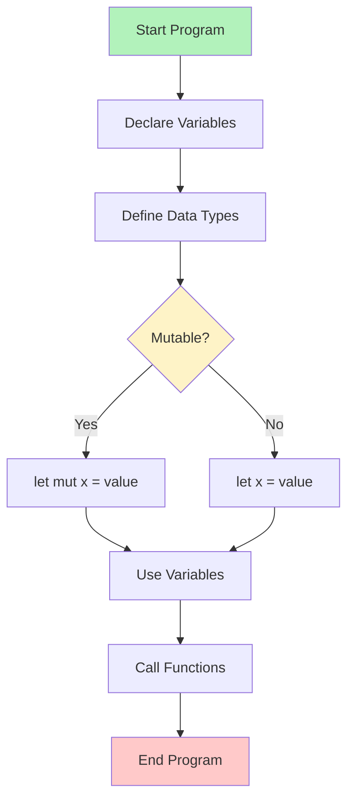
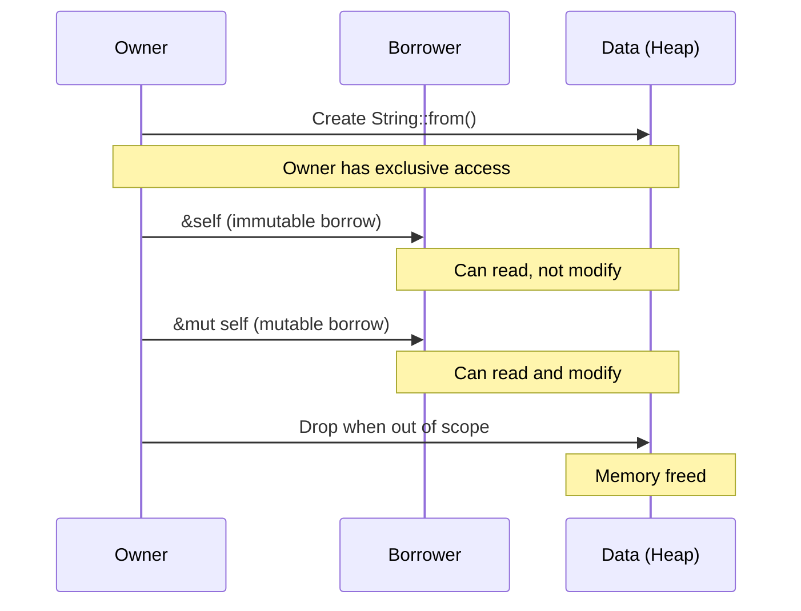
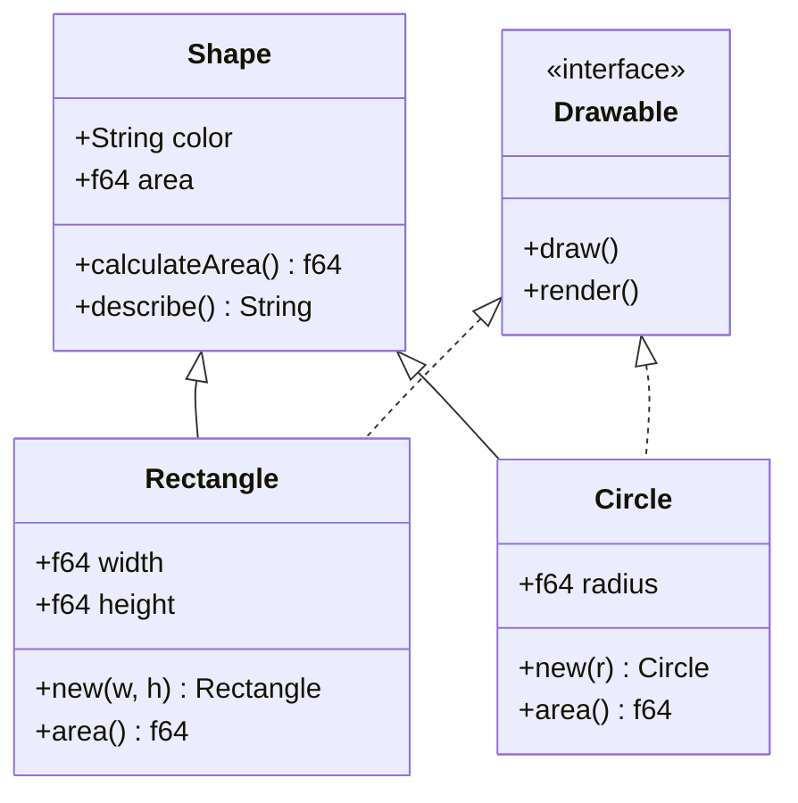
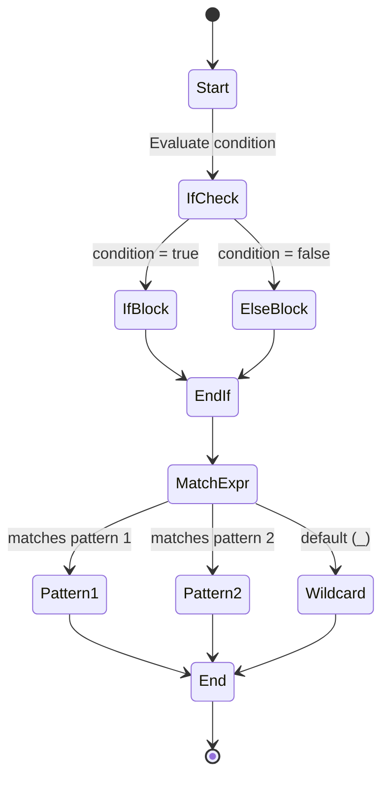
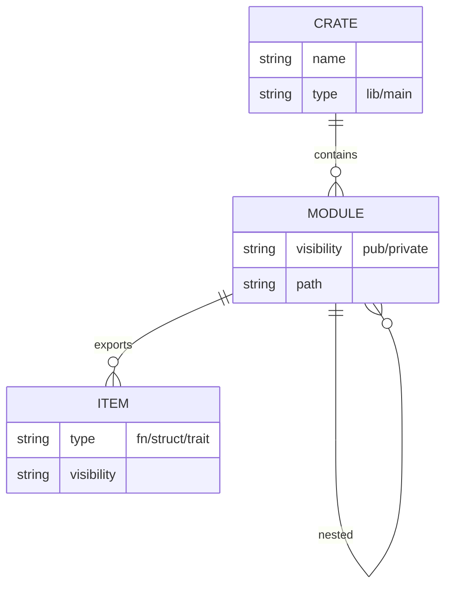
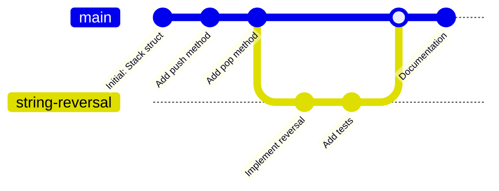
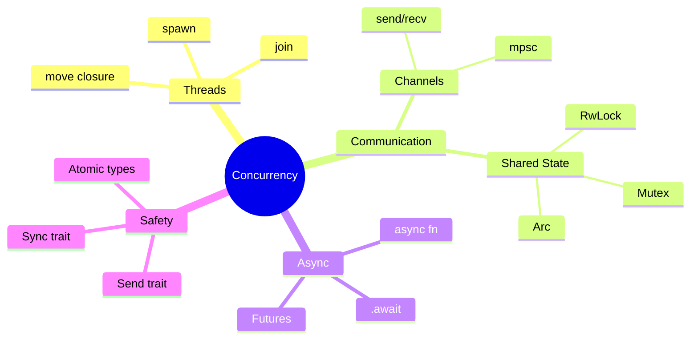
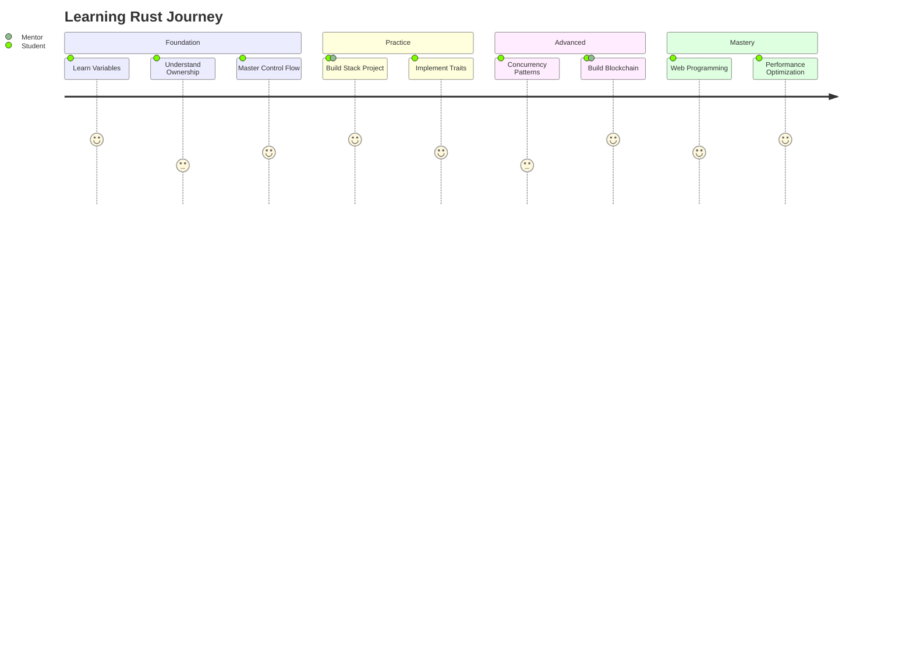
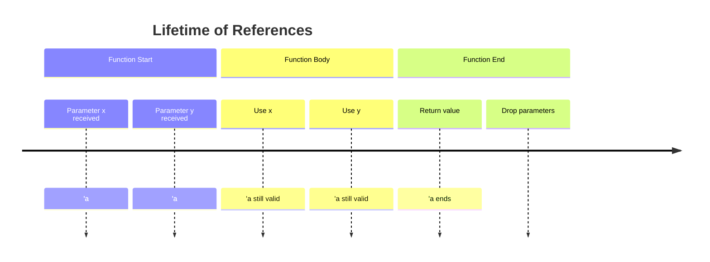
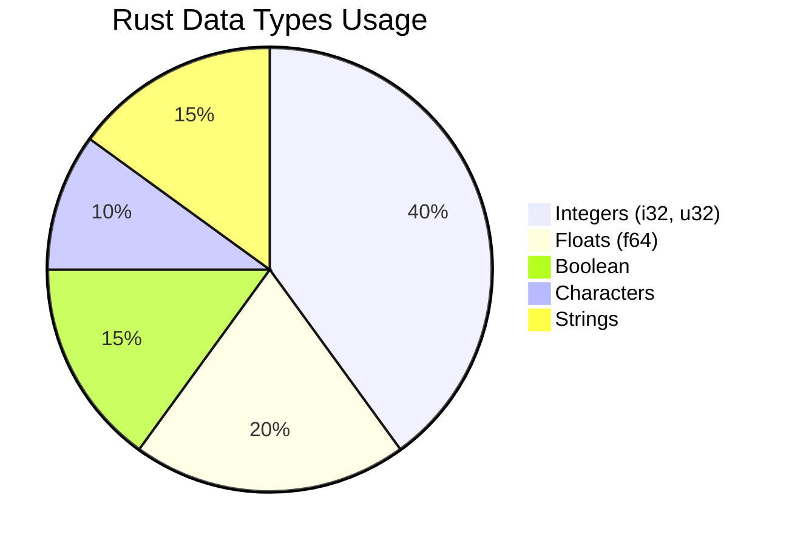

# Mermaid Diagrams from Rust Course Code

This document shows what Mermaid diagrams can be generated from the Rust course code examples.

## 1. Flowchart - Chapter 2: Basic Programming



## 2. Sequence Diagram - Chapter 3: Ownership



## 3. Class Diagram - Chapter 6: Structs & Traits



## 4. State Diagram - Chapter 4: Control Structures



## 5. ER Diagram - Chapter 8: Modules



## 6. Git Graph - Chapter 5: Stack Project



## 7. Mindmap - Chapter 14: Concurrency



## 8. Gantt Chart - Course Timeline

```mermaid
gantt
    title Rust Master Class Timeline
    dateFormat  YYYY-MM-DD
    section Basics
    Chapter 2: Basic Programming :done, ch2, 2024-01-01, 7d
    Chapter 3: Ownership :done, ch3, after ch2, 5d
    Chapter 4: Control Structures :done, ch4, after ch3, 5d
    section Intermediate
    Chapter 5: Stack Project :active, ch5, after ch4, 7d
    Chapter 6-9: Advanced Topics : ch6, after ch5, 14d
    section Advanced
    Chapter 14: Concurrency : ch14, after ch6, 10d
    Chapter 24: Blockchain : ch24, after ch14, 14d
```

## 9. Journey Diagram - Learning Path



## 10. Timeline - Chapter 7: Lifetimes



## 11. C4 Container Diagram - Chapter 25: Web Programming

```mermaid
C4Container
    title Web Application Architecture
    
    Person(user, "User", "Web browser user")
    
    Container_Boundary(web_app, "Web Application") {
        Container(frontend, "Frontend", "Rust + WebAssembly", "Handles UI and user interactions")
        Container(backend, "Backend API", "Rust + Actix", "REST API and business logic")
        ContainerDb(database, "Database", "PostgreSQL", "Stores user data and content")
    }
    
    Rel(user, frontend, "Uses", "HTTPS")
    Rel(frontend, backend, "Calls", "JSON/HTTP")
    Rel(back, database, "Reads/Writes", "SQL")
```

## 12. Pie Chart - Chapter 2: Data Types Distribution



---

## How to Generate These with Mermaid MCP

Once installed, the Mermaid MCP server would provide tools like:

```bash
# Generate SVG from Mermaid code
mcp-cli call mermaid generate_svg '{"code": "flowchart TD\\nA --> B", "output": "diagram.svg"}'

# Generate PNG
mcp-cli call mermaid generate_png '{"code": "sequenceDiagram\\nAlice->>Bob", "output": "diagram.png"}'

# Validate syntax
mcp-cli call mermaid validate '{"code": "flowchart TD\\nA -->"}'
```

## Integration with Rust Course

Each chapter can have:
1. **Flowcharts** for code logic
2. **Sequence diagrams** for ownership/borrowing
3. **Class diagrams** for structs and traits
4. **State diagrams** for control flow
5. **Mindmaps** for concept organization
6. **Gantt charts** for project timelines
7. **Journey diagrams** for learning paths
